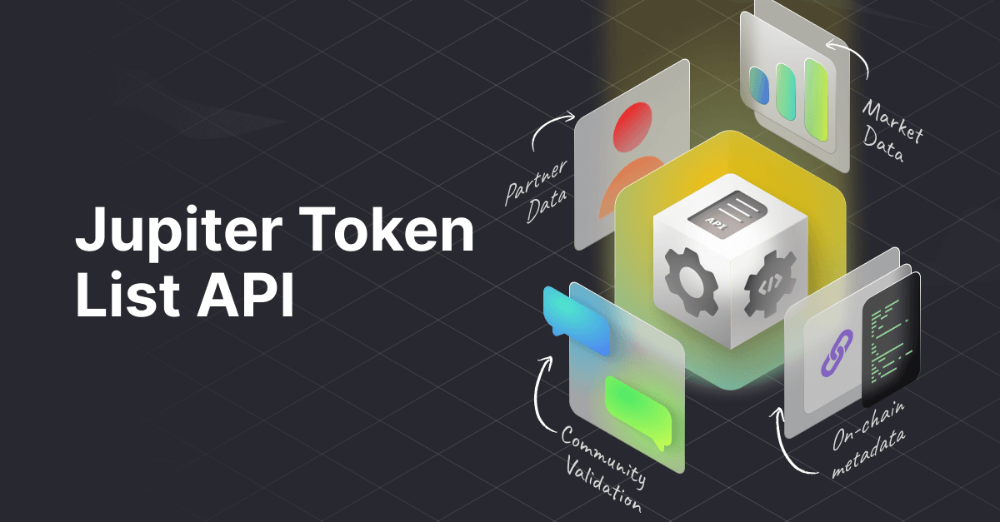
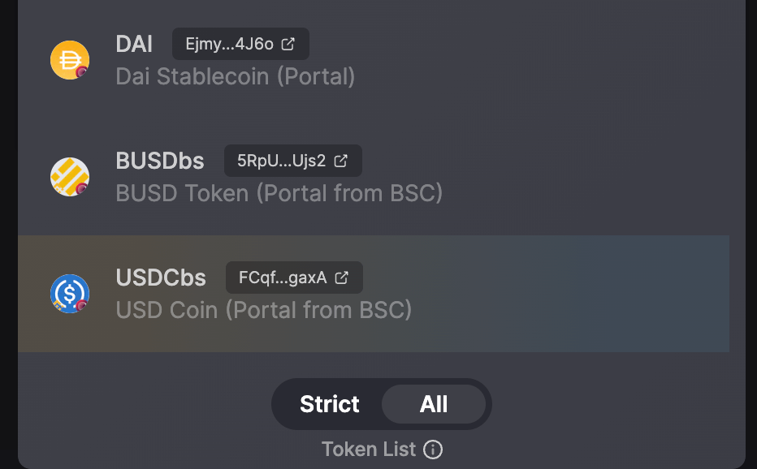
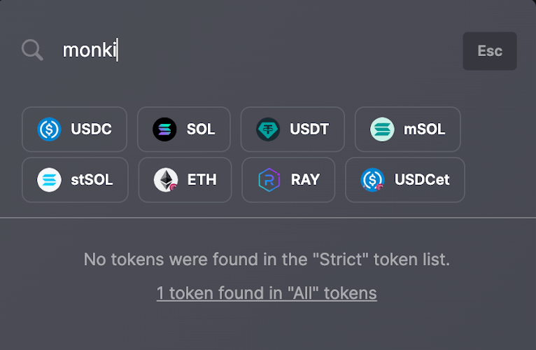

Introducing the Jupiter Token List API – an open, collaborative and dynamic token list to make trading on Solana a more transparent and safer experience for users and developers.



Today, we are introducing the Jupiter Token List API. We are designing this token list to be open, collaborative, and dynamic, to build a safer and more transparent trading experience for users and developers. 

A key part of our **JUP Promise (Best Price, Best Token Selection, Best UX)** is the idea that users should be able to trade any token they want on Jupiter while having the peace of mind that the token they are trading is the right one. 

<!--truncate-->

This is super challenging in DeFi when the only true identifier of a token is its mint address, versus the more commonly human-referenced metadata of a project, such as its symbol, name, and icon, that can be impersonated. With new projects being created every day, it is not only difficult for protocols to police but it also creates a burden for users to be extra careful with what they're trading.

Having an up-to-date and trusted token list is crucial for both users and projects. Users depend heavily on the applications to display the right tokens. New projects want their tokens to be discoverable and tradable everywhere, whether they are famous or not. 

In addition, a robust list should contain other types of data to give us the full picture of a token, including on-chain metadata from project creators, actual market liquidity, data from developers like Wormhole, SolanaFm, Birdeye, AllBridge, and community validation data.

With all these in mind, we would like to share how we addressed safety, openness, and the ability to trade any token while incorporating various sources of data into the token list.

## Our Approach
1. **Dynamic:** The full list updates automatically with new projects as long as there is sufficient liquidity. This makes it available for trading on Jupiter immediately.
2. **Open:** We include market and partner data about a token so you can choose what you need. The full list will always contain all tokens available for trade to give open access to all projects.
3. **Safety:** Only validated tokens are shown on the 'Strict' list by default.
4. **Collaborative:** We engage ecosystem partners to build a robust and comprehensive list with us by including their data. 
5. **Community Driven:** Our community drives the token-list validation process.

For example, take this USDCet token symbol. 

```typescript
{
    "address":"A9mUU4qviSctJVPJdBJWkb28deg915LYJKrzQ19ji3FM",
    "chainId":101,
    "decimals":6,
    "name":"USD Coin (Portal from Ethereum)",
    "symbol":"USDCet",
    "logoURI":"https://raw.githubusercontent.com/solana-labs/token-list/main/assets/mainnet/A9mUU4qviSctJVPJdBJWkb28deg915LYJKrzQ19ji3FM/logo.png",
    "extensions":{
        "coingeckoId":"usd-coin-wormhole-from-ethereum"
    },
    "tags":[
        "old-registry",
        "wormhole"
    ]
}
```

You can see that this token has 2 tags – it is found in both the old Solana token registry and the list of bridged Wormhole tokens.

In following these 3 key principles of being collaborative, dynamic & open, we hope to build up a comprehensive solution for everyone in the ecosystem while taking care of the safety of users.

---

# Token List API

The API has a **“strict”** option – which we use as the default on our UI. 

The strict list only includes tokens from Solana’s original token list, Wormhole’s token list, and Jupiter’s community-validated tokens. It freezes important metadata (symbol, name, logo) on validation to stop projects from changing their metadata to impersonate another token.

## Endpoints

Jupiter’s token lists are designed to be open. We include tags about its source so that developers can choose the tokens for their use case. For your convenience, we included the tokens we show in “strict” mode on our UI in a separate endpoint.

**Strict:** https://token.jup.ag/strict

- This returns only tokens that are tagged "old-registry", "community", or "wormhole" verified. No unknown and banned tokens are returned.

**All:** https://token.jup.ag/all

- This returns all tokens including unknown/ untagged tokens.
- It does not include banned tokens by default. To bring up banned tokens, append this flag to the endpoint. (?includeBanned=true).
- Our lists are designed for trading and so only lists tokens that satisfy our minimum liquidity requirements and are available for trading on Solana.

## Metadata

**Tags:** Each token can have 1 or more of the following:

- **Old-registry:** These are tokens added to the archived solana labs token list repo before July 2022. As this is the original token list in Solana, the tokens here are generally more recognised.
- **Community:** These are tokens attested by Jupiter's communities, including newer and widely traded tokens created after the old-registry was archived like Bonk and Hades.
- **Wormhole:** These are bridged assets to Solana via wormhole, mostly from Ethereum.
- **No tags / Unknown ("tags:[ ]"):** These are tokens that are picked up automatically by Jupiter.

**Extensions:**
- **isBanned:** These tokens are flagged by our community, typically for trying to impersonate another project.

---

# Jupiter App
Our UI uses the API and defaults to showing tokens from the “Strict” list. Users can toggle on the “All” list that includes unknown tokens.



Even if the token has not been immediately validated, it will still be surfaced via symbol and mint address search with additional prompts.



## Community Validation for Strict Mode (BETA)

Our community drives the token vetting process. We are iterating on it together, with a focus on safety and openness.

To follow the conversation, see [our public Github Repo](https://github.com/jup-ag/token-list) and talk to us in [our discord](https://discord.gg/jup).

## Collaborate with us
The Jupiter Token API is still early and we want to work w everyone – users, community members, protocols, and data consumers to build a better one:

- **Ecosystem Partners:** If you have your own token data (e.g. Wormhole tokens, SolanaFM validated tokens) that we can incorporate, let us know.
- **Community:** Join our validation process and tell us what you want to see in the strict list!
- **Users:** Try out the 2 modes on the UI and give us feedback!

We are excited to improve on the **JUP Promise** – of the *best price, best UX, and best token discovery* – to our users and the ecosystem, letting users discover all tokens while helping them to stay safe.

**The Jupiter Token API is our third API on top of the Price API and Swap API, joining a set of important lego pieces to unlock trading and liquidity on Solana.** 

**A robust token list is fundamental to any DeFi trading landscape - let’s work together towards a safer, more dynamic, and open trading env on Solana!**