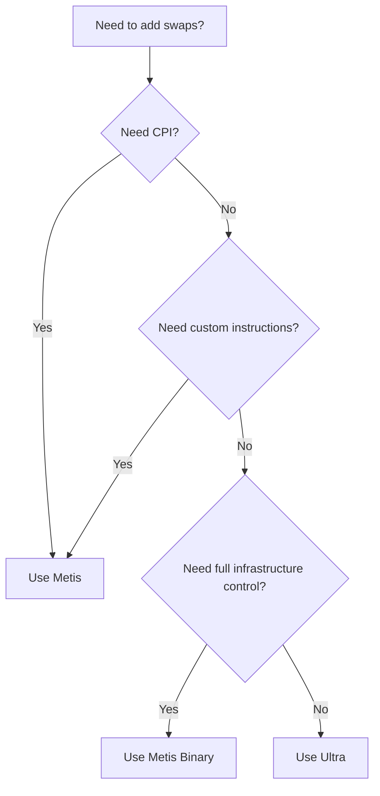

Last week, a developer DMed me on Twitter. "Hey, I'm integrating swaps. Should I use Ultra or Metis? What's the difference?"

I get this question a lot. Like, a lot a lot. So I figured I'd write it down once and point people here.

**Use Ultra.** Unless you need CPI or custom instructions.

I know that sounds like marketing. It's not. Let me explain.

---

## The three options

We have three swap products:

- **Ultra** - We handle everything. You get an order, sign it, submit it. Done.
- **Metis API** - We give you the routing. You handle everything else.
- **Metis Binary** - You run the whole thing yourself.

The rest of this post is just details.

---

## What Ultra actually does

Ultra is our opinionated, end-to-end execution engine. "Opinionated" means we made decisions for you. Lots of them.

When you call Ultra, here's what happens behind the scenes:

1. We route through Iris, JupiterZ (20+ market makers), DFlow, OKX, and more
2. We estimate slippage using RTSE (Real-Time Slippage Estimator)
3. We calculate priority fees so you don't overpay
4. We land the transaction through Jupiter Beam, our internal transaction landing infrastructure
5. We protect you from MEV (we have the [lowest value extraction in the industry](https://sandwiched.me))
6. We handle errors and give you clear responses

You don't see any of this. You just get an order, sign it, and submit it.

This is the same infrastructure that powers jup.ag. Same systems, same performance.

**The integration looks like this:**

```typescript
// Get order
const order = await fetch(
  `https://api.jup.ag/ultra/v1/order?inputMint=${input}&outputMint=${output}&amount=${amount}&taker=${wallet}`
).then(r => r.json());

// Sign
const tx = VersionedTransaction.deserialize(Buffer.from(order.transaction, 'base64'));
const signed = await wallet.signTransaction(tx);

// Execute
const result = await fetch('https://api.jup.ag/ultra/v1/execute', {
  method: 'POST',
  headers: { 'Content-Type': 'application/json' },
  body: JSON.stringify({
    signedTransaction: Buffer.from(signed.serialize()).toString('base64'),
    requestId: order.requestId,
  }),
}).then(r => r.json());
```

**20 lines. Get order, sign, execute. Done.**

No RPC. No slippage tuning. No priority fee estimation. No polling. We handle all of it.

---

## What Metis is for

Metis is our original routing engine. We [spun it out as an independent public good](https://metis.builders), separate from Jupiter.

Unlike Ultra, Metis gives you raw swap instructions instead of a locked transaction. This means you can:

- Call swaps from your on-chain program via CPI
- Add custom instructions to the transaction
- Filter which DEXes to route through
- Control account usage

But here's the catch: **you handle everything else**.

That means:
- Your RPC infrastructure (and fallbacks, and rate limits)
- Your transaction broadcasting
- Your slippage estimation (different for stables, LSTs, memecoins...)
- Your priority fee calculation
- Your MEV protection strategy
- Your transaction polling and error handling
- Your retry logic

Metis gives you the routing brain. You build the body.

### The two flavors

**Metis API** is the hosted version. Previously called "Legacy Swap API," it's available through [portal.jup.ag](https://portal.jup.ag). You get the routing without running servers.

**Metis Binary** is the self-hosted version. You run your own instance of the routing engine. Zero external dependencies. Complete control. This is for exchanges and high-frequency operations where every millisecond matters.

---

## What a production Metis integration actually looks like

I could show you the happy path. 20 lines, call quote, build swap, sign, send. Easy.

But that's not what production looks like. Here's what a real Metis integration involves:

```typescript
// RPC setup with fallbacks
const RPC_ENDPOINTS = ['https://rpc1.example.com', 'https://rpc2.example.com'];
let currentRpcIndex = 0;

function getConnection() {
  return new Connection(RPC_ENDPOINTS[currentRpcIndex]);
}

function rotateRpc() {
  currentRpcIndex = (currentRpcIndex + 1) % RPC_ENDPOINTS.length;
}

// Slippage estimation (you build this logic)
function estimateSlippage(inputMint: string, outputMint: string): number {
  const stables = ['EPjFWdd5AufqSSqeM2qN1xzybapC8G4wEGGkZwyTDt1v', 'Es9vMFrzaCERmJfrF4H2FYD4KCoNkY11McCe8BenwNYB'];
  if (stables.includes(inputMint) && stables.includes(outputMint)) return 10;
  // Add more logic for LSTs, volatile tokens, memecoins...
  return 100; // Default 1%
}

// Priority fee estimation
async function estimatePriorityFee(connection: Connection): Promise<number> {
  try {
    const fees = await connection.getRecentPrioritizationFees();
    const sorted = fees.map(f => f.prioritizationFee).sort((a, b) => b - a);
    return sorted[Math.floor(sorted.length * 0.25)] || 10000;
  } catch {
    return 100000; // Fallback
  }
}

// Main swap function with error handling and retries
async function executeSwap(
  wallet: Keypair,
  inputMint: string,
  outputMint: string,
  amount: number,
  maxRetries = 3
): Promise<string> {
  let lastError: Error | null = null;

  for (let attempt = 0; attempt < maxRetries; attempt++) {
    const connection = getConnection();
    
    try {
      // 1. Get quote with estimated slippage
      const slippageBps = estimateSlippage(inputMint, outputMint);
      const quoteResponse = await fetch(
        `https://api.jup.ag/swap/v1/quote?inputMint=${inputMint}&outputMint=${outputMint}&amount=${amount}&slippageBps=${slippageBps}`
      );
      
      if (!quoteResponse.ok) {
        throw new Error(`Quote failed: ${quoteResponse.status}`);
      }
      const quote = await quoteResponse.json();

      // 2. Estimate priority fee
      const priorityFee = await estimatePriorityFee(connection);

      // 3. Build swap transaction
      const swapResponse = await fetch('https://api.jup.ag/swap/v1/swap', {
        method: 'POST',
        headers: { 'Content-Type': 'application/json' },
        body: JSON.stringify({
          quoteResponse: quote,
          userPublicKey: wallet.publicKey.toString(),
          dynamicComputeUnitLimit: true,
          prioritizationFeeLamports: { priorityLevelWithMaxLamports: { maxLamports: priorityFee, priorityLevel: "veryHigh" } }
        })
      });
      
      if (!swapResponse.ok) {
        throw new Error(`Swap build failed: ${swapResponse.status}`);
      }
      const swap = await swapResponse.json();

      if (swap.simulationError) {
        throw new Error(`Simulation failed: ${swap.simulationError}`);
      }

      // 4. Sign and send
      const tx = VersionedTransaction.deserialize(Buffer.from(swap.swapTransaction, 'base64'));
      tx.sign([wallet]);

      const signature = await connection.sendRawTransaction(tx.serialize(), {
        skipPreflight: true,
        maxRetries: 2,
      });

      // 5. Poll for confirmation with timeout
      const startTime = Date.now();
      const timeout = 60000;
      
      while (Date.now() - startTime < timeout) {
        const status = await connection.getSignatureStatus(signature);
        
        if (status.value?.confirmationStatus === 'confirmed' || status.value?.confirmationStatus === 'finalized') {
          return signature;
        }
        
        if (status.value?.err) {
          throw new Error(`Transaction failed: ${JSON.stringify(status.value.err)}`);
        }
        
        await new Promise(r => setTimeout(r, 500));
      }
      
      throw new Error('Transaction confirmation timeout');

    } catch (error) {
      lastError = error as Error;
      console.error(`Attempt ${attempt + 1} failed:`, error);
      rotateRpc();
      await new Promise(r => setTimeout(r, 1000 * (attempt + 1)));
    }
  }

  throw lastError || new Error('All retry attempts failed');
}
```

This is ~100 lines. And it still doesn't include:
- MEV protection
- Dynamic slippage adjustment based on execution history
- Proper logging and monitoring
- Rate limit handling
- Blockhash management

I'm showing this because developers often underestimate what "you handle the rest" actually means in practice.

---

## The comparison

| Aspect | Ultra | Metis API | Metis Binary |
|---|---|---|---|
| **Aggregation** | Iris + DFlow + OKX + JupiterZ | Metis only | Metis only |
| **RFQ Support** | 20+ market makers | No | No |
| **RPC Required** | No | Yes | Yes |
| **Transaction Landing** | Jupiter Beam (50-400ms) | Your infrastructure | Your infrastructure |
| **Slippage** | RTSE (automatic) | Manual | Manual |
| **Priority Fees** | Auto-optimized | Manual | Manual |
| **MEV Protection** | Lowest in industry | Your responsibility | Your responsibility |
| **CPI Support** | No | Yes | Yes |
| **Custom Instructions** | No | Yes | Yes |
| **Gasless** | Built-in | Integrator as Payer | Integrator as Payer |

---

## When to use what

**Use Ultra when:**
- You want swaps that just work
- You don't need to modify the transaction
- You want gasless support for your users
- You'd rather ship features than manage infrastructure

**Use Metis API when:**
- You're building an on-chain program that calls swaps via CPI
- You need to add custom instructions to the transaction
- You have specific DEX filtering requirements

**Use Metis Binary when:**
- You're an exchange or high-frequency trading operation
- You need zero external dependencies
- You're willing to manage servers, failovers, updates, and monitoring

---

## Questions I get asked

**"But Metis is faster, right?"**

Ultra's `/order` endpoint averages around 300ms (P50). Yes, Metis quotes can be faster. But that extra time is spent on simulations, slippage estimation, and route optimization. Raw quote speed doesn't help if your transaction fails or gets sandwiched.

**"Metis gives better prices because I can optimize myself"**

Maybe. But Ultra aggregates more liquidity sources and uses Predictive Execution to simulate routes before sending. You'd be competing against systems trained on billions in daily volume. We've found Ultra delivers better *executed* prices, not just quoted prices.

**"I don't want to pay Ultra's fee"**

Fair. Ultra's platform fee is 5-10 bps. But consider what that fee buys you: gasless infrastructure, MEV protection, transaction landing, slippage optimization. If you're building that yourself, you're paying in engineering time instead of basis points.

**"I can add my own MEV protection"**

Unless you have validator relationships and your own transaction landing infrastructure, your transactions are visible to searchers before they land. Ultra uses Jupiter Beam, which sends directly to validators we work with. [The data is public](https://sandwiched.me): Ultra has the lowest value extraction ratio despite the highest volume.

---

## The decision tree



If you're building a wallet, a trading bot, a DeFi app, basically anything where you just need swaps to work, use Ultra.

If you're building an on-chain program that needs to compose with swaps, use Metis API.

If you're Binance, use Metis Binary.

---

## Getting started

**Ultra API:** [dev.jup.ag/docs/ultra](https://dev.jup.ag/docs/ultra)

**Metis API:** [dev.jup.ag/docs/swap](https://dev.jup.ag/docs/swap)

**Metis Binary:** [metis.builders](https://metis.builders)

---

If you're asking "which one should I use?" that's usually a sign you should use Ultra. The people who need Metis already know they need it, because they're building something that requires CPI or custom instructions.

For everyone else: use Ultra. Ship your product. Let us handle the infrastructure.

Go build something.

---

**Questions?**
- Discord: [discord.gg/jup](https://discord.gg/jup)
- Twitter: [@JupiterExchange](https://twitter.com/JupiterExchange)

Built something? Tag [@JupDevrel](https://twitter.com/JupDevrel) or [@0xanmol](https://twitter.com/0xanmol).
