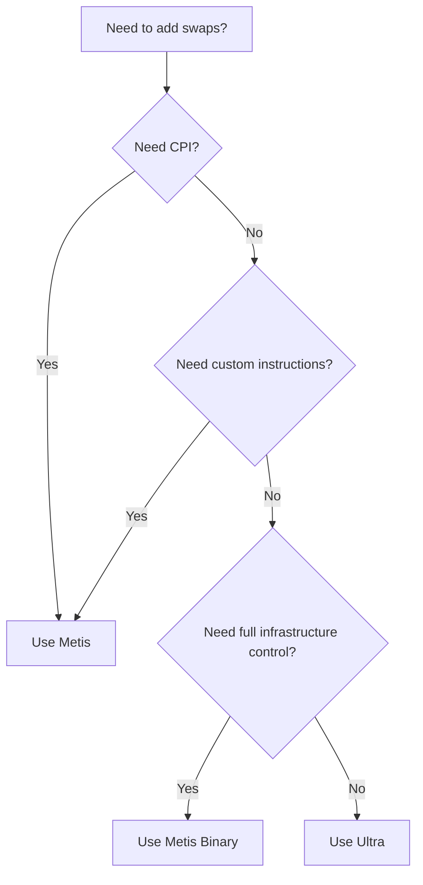

You want to add swaps to your app. You've found Ultra. You've found Metis. Maybe you've heard about Metis Binary. Now you're confused.

This is the most common question we get from developers: "Which one should I use?"

The answer is simpler than you think. Let's break it down.

---

## The Short Answer

**Use Ultra.** Unless you have a specific reason not to.

The only reasons to use Metis are:
1. You need CPI (Cross Program Invocation) to call swaps from your on-chain program
2. You need to add custom instructions to the transaction
3. You need complete control over your infrastructure

If none of those apply, Ultra is the answer. Close this tab. Go build.

Still here? Let's get specific.

---

## What Is Ultra?

Ultra is Jupiter's end-to-end execution engine. It's opinionated by design. You get an order, sign it, submit it. Jupiter handles everything else.

<Card title="What Ultra Handles For You">
- **Routing**: Aggregates Iris, JupiterZ (20+ market makers), DFlow, OKX, and more
- **Transaction Landing**: Jupiter Beam (our internal transaction landing infrastructure) lands transactions in 50-400ms
- **Slippage**: RTSE (Real-Time Slippage Estimator) optimizes automatically
- **Priority Fees**: Dynamically optimized without overpaying
- **MEV Protection**: Lowest value extraction in the industry ([sandwiched.me](https://sandwiched.me))
- **Gasless Swaps**: Users can swap without holding SOL for gas
- **Error Handling**: Clear responses instead of obscure on-chain errors
</Card>

Ultra powers jup.ag. The same infrastructure. The same performance. Available via API.

---

## What Is Metis?

Metis is Jupiter's original low-level routing engine. It's now an independent public good at [metis.builders](https://metis.builders), separate from Jupiter.

Unlike Ultra, Metis gives you raw swap instructions instead of a locked transaction. This means you get granular control - but you also handle everything else yourself.

Metis is available in two forms:

### Metis API

Previously known as the Legacy Swap API, Metis API is hosted by Jupiter and available through the [Developer Platform](https://portal.jup.ag). You get the Metis routing engine without running your own infrastructure.

<Card title="What Metis API Gives You">
- **Raw Instructions**: Build your own transaction with swap instructions
- **CPI Support**: Call swaps from your on-chain program
- **Custom Instructions**: Add your own logic to the transaction
- **DEX Filtering**: Choose which DEXes to route through
- **Account Modification**: Control the number of accounts used
</Card>

**What you handle:**
- Your RPC infrastructure
- Your transaction broadcasting
- Your slippage optimization
- Your priority fee estimation
- Your MEV protection strategy
- Your transaction polling and error handling

Metis API is the routing brain. You build the rest.

### Metis Binary

Metis Binary is the self-hosted version. Instead of calling Jupiter's hosted API, you run your own instance of the Metis routing engine.

**Why self-host?**
- Zero external dependencies during execution
- Complete infrastructure control
- Mission-critical uptime requirements
- High-frequency trading operations

If you're an exchange or running infrastructure where every millisecond and every dependency matters, Metis Binary is for you. Access is available through [metis.builders](https://metis.builders).

---

## The Comparison

| Aspect | Ultra API | Metis API | Metis Binary |
|--------|-----------|-----------|--------------|
| **Aggregation** | Iris + DFlow + OKX + JupiterZ | Metis only | Metis only |
| **RFQ Support** | 20+ market makers | No | No |
| **RPC Required** | No | Yes | Yes |
| **Transaction Landing** | Jupiter Beam (50-400ms) | Your infrastructure | Your infrastructure |
| **Slippage** | RTSE (automatic) | Manual | Manual |
| **Priority Fees** | Auto-optimized | Manual | Manual |
| **MEV Protection** | Lowest in industry | Your responsibility | Your responsibility |
| **CPI Support** | No | Yes | Yes |
| **Custom Instructions** | No | Yes | Yes |
| **Gasless** | Built-in | Integrator as Payer | Integrator as Payer |
| **P95 Quote Latency** | Under 900ms | Under 500ms | Your infrastructure |
| **P95 Execution** | Under 1000ms | Your optimization | Your optimization |
| **Fee Collection** | Referral or Advanced Fee | Direct to your wallet | Direct to your wallet |

---

## When To Use Each

### Use Ultra When:

- You don't need granular control over the swap transaction
- You want swaps that work out of the box with best-in-class quotes and execution
- You want gasless support for your users
- You don't want to manage RPCs, slippage, priority fees, or transaction landing yourself
- You want to ship fast

**Integration complexity:** ~20 lines of code

```typescript
// Get order
const order = await fetch(
  `https://api.jup.ag/ultra/v1/order?inputMint=${input}&outputMint=${output}&amount=${amount}&taker=${wallet}`
).then(r => r.json());

// Sign
const tx = VersionedTransaction.deserialize(Buffer.from(order.transaction, 'base64'));
const signed = await wallet.signTransaction(tx);

// Execute
const result = await fetch('https://api.jup.ag/ultra/v1/execute', {
  method: 'POST',
  headers: { 'Content-Type': 'application/json' },
  body: JSON.stringify({
    signedTransaction: Buffer.from(signed.serialize()).toString('base64'),
    requestId: order.requestId,
  }),
}).then(r => r.json());
```

**20 lines. Get order, sign, execute. Done.**

---

### Use Metis API When:

- You're building an on-chain program that needs to call swaps via CPI
- You need to compose swaps with other instructions in the same transaction
- You need instruction-level control over the swap but don't want to run your own infrastructure

**Integration complexity:** Here's what a production-ready Metis integration actually looks like:

```typescript
// RPC setup with fallbacks
const RPC_ENDPOINTS = ['https://rpc1.example.com', 'https://rpc2.example.com'];
let currentRpcIndex = 0;

function getConnection() {
  return new Connection(RPC_ENDPOINTS[currentRpcIndex]);
}

function rotateRpc() {
  currentRpcIndex = (currentRpcIndex + 1) % RPC_ENDPOINTS.length;
}

// Slippage estimation (you build this logic)
function estimateSlippage(inputMint: string, outputMint: string): number {
  const stables = ['EPjFWdd5AufqSSqeM2qN1xzybapC8G4wEGGkZwyTDt1v', 'Es9vMFrzaCERmJfrF4H2FYD4KCoNkY11McCe8BenwNYB'];
  if (stables.includes(inputMint) && stables.includes(outputMint)) return 10;
  // Add more logic for LSTs, volatile tokens, memecoins...
  return 100; // Default 1%
}

// Priority fee estimation
async function estimatePriorityFee(connection: Connection): Promise<number> {
  try {
    const fees = await connection.getRecentPrioritizationFees();
    const sorted = fees.map(f => f.prioritizationFee).sort((a, b) => b - a);
    return sorted[Math.floor(sorted.length * 0.25)] || 10000;
  } catch {
    return 100000; // Fallback
  }
}

// Main swap function with error handling and retries
async function executeSwap(
  wallet: Keypair,
  inputMint: string,
  outputMint: string,
  amount: number,
  maxRetries = 3
): Promise<string> {
  let lastError: Error | null = null;

  for (let attempt = 0; attempt < maxRetries; attempt++) {
    const connection = getConnection();
    
    try {
      // 1. Get quote with estimated slippage
      const slippageBps = estimateSlippage(inputMint, outputMint);
      const quoteResponse = await fetch(
        `https://api.jup.ag/swap/v1/quote?inputMint=${inputMint}&outputMint=${outputMint}&amount=${amount}&slippageBps=${slippageBps}`
      );
      
      if (!quoteResponse.ok) {
        throw new Error(`Quote failed: ${quoteResponse.status}`);
      }
      const quote = await quoteResponse.json();

      // 2. Estimate priority fee
      const priorityFee = await estimatePriorityFee(connection);

      // 3. Build swap transaction
      const swapResponse = await fetch('https://api.jup.ag/swap/v1/swap', {
        method: 'POST',
        headers: { 'Content-Type': 'application/json' },
        body: JSON.stringify({
          quoteResponse: quote,
          userPublicKey: wallet.publicKey.toString(),
          dynamicComputeUnitLimit: true,
          prioritizationFeeLamports: { priorityLevelWithMaxLamports: { maxLamports: priorityFee, priorityLevel: "veryHigh" } }
        })
      });
      
      if (!swapResponse.ok) {
        throw new Error(`Swap build failed: ${swapResponse.status}`);
      }
      const swap = await swapResponse.json();

      if (swap.simulationError) {
        throw new Error(`Simulation failed: ${swap.simulationError}`);
      }

      // 4. Sign and send
      const tx = VersionedTransaction.deserialize(Buffer.from(swap.swapTransaction, 'base64'));
      tx.sign([wallet]);

      const signature = await connection.sendRawTransaction(tx.serialize(), {
        skipPreflight: true,
        maxRetries: 2,
      });

      // 5. Poll for confirmation with timeout
      const startTime = Date.now();
      const timeout = 60000;
      
      while (Date.now() - startTime < timeout) {
        const status = await connection.getSignatureStatus(signature);
        
        if (status.value?.confirmationStatus === 'confirmed' || status.value?.confirmationStatus === 'finalized') {
          return signature;
        }
        
        if (status.value?.err) {
          throw new Error(`Transaction failed: ${JSON.stringify(status.value.err)}`);
        }
        
        await new Promise(r => setTimeout(r, 500));
      }
      
      throw new Error('Transaction confirmation timeout');

    } catch (error) {
      lastError = error as Error;
      console.error(`Attempt ${attempt + 1} failed:`, error);
      rotateRpc();
      await new Promise(r => setTimeout(r, 1000 * (attempt + 1)));
    }
  }

  throw lastError || new Error('All retry attempts failed');
}
```

This is ~100 lines and still doesn't include:
- MEV protection
- Dynamic slippage adjustment based on execution history
- Proper logging and monitoring
- Rate limit handling
- Blockhash management

---

### Use Metis Binary When:

- You're an exchange or high-frequency operation
- You need zero external dependencies during execution
- Latency and uptime are mission-critical
- You want to run your own infrastructure

**Integration complexity:** Everything from Metis API, plus:
- Hosting and running the binary on your own servers
- Managing uptime, failovers, and scaling
- Handling binary updates and version migrations
- Monitoring binary health and performance

---

## Questions We Often Get

**"Metis gives better prices because I can optimize myself"**

Ultra aggregates more liquidity sources (Iris, JupiterZ, DFlow, OKX) and uses Predictive Execution to simulate routes before sending. You're competing against systems trained on billions in daily volume. The data shows Ultra delivers better executed prices, not just quoted prices.

**"I need Metis for lower latency"**

Ultra's P95 quote latency is under 900ms (average 100-200ms). The extra latency comes from simulations, slippage estimation, and optimizations that result in better execution. Raw quote speed doesn't matter if your transaction fails or gets sandwiched.

**"Ultra takes a fee, Metis doesn't"**

Ultra's platform fee is 5-10 bps. But Ultra also provides gasless support and significantly lower MEV exposure. The fee pays for infrastructure you'd otherwise build yourself.

**"I can add my own MEV protection"**

Unless you have your own validator stake and transaction landing infrastructure, you're using public mempools. Ultra uses Jupiter Beam on Jupiter's own infrastructure. [The data is public](https://sandwiched.me/sandwiches): Ultra has the lowest value extraction ratio despite the highest volume.

---

## The Decision Tree



---

## Getting Started

**Ultra API:** [dev.jup.ag/docs/ultra](https://dev.jup.ag/docs/ultra)

**Metis API:** [dev.jup.ag/docs/swap](https://dev.jup.ag/docs/swap)

**Metis Binary:** [metis.builders](https://metis.builders)

---

## Conclusion

If you're asking which to use, use Ultra.

If you need CPI or custom instructions, use Metis API.

If you need complete infrastructure control, use Metis Binary.

That's it. Now go build.

---

**Talk to us:**
- Discord: [discord.gg/jup](https://discord.gg/jup)
- Twitter: [@JupiterExchange](https://twitter.com/JupiterExchange)

Built something? Tag [@JupDevrel](https://twitter.com/JupDevrel) or [@0xanmol](https://twitter.com/0xanmol).
