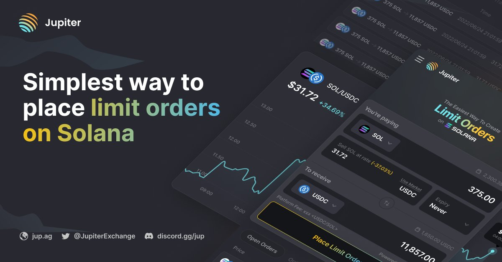

# Limit Order API

Jupiter Limit Order provides users with the simplest way to place limit orders on Solana and receive tokens directly in your wallet when the order is filled!



## Create Limit Order

**1. Install the libraries**

To run this example requires a minimum of [NodeJS 16](https://nodejs.org/en). In your command line terminal, install the libraries.

```bash
npm i @solana/web3.js
npm i cross-fetch
npm i @project-serum/anchor
npm i bs58
```

**2. Import from libraries and setup connection**

Next you can copy the following code snippets to a javascript file *jupiter-api-example.js*. And when you are ready to run the code, just type: *node jupiter-api-example.js*

```js
import { Connection, Keypair, VersionedTransaction } from '@solana/web3.js';
import fetch from 'cross-fetch';
import { Wallet } from '@project-serum/anchor';
import bs58 from 'bs58';

// It is recommended that you use your own RPC endpoint.
// This RPC endpoint is only for demonstration purposes so that this example will run.
const connection = new Connection('https://neat-hidden-sanctuary.solana-mainnet.discover.quiknode.pro/2af5315d336f9ae920028bbb90a73b724dc1bbed/');
```

:::info
Always make sure that you are using your own RPC endpoint. The RPC endpoint used by the connection object in the above example may not work anymore.
:::

**3. Setup your wallet**

In this example, you can paste in your private key for testing purposes but this is not recommended for production applications.

```js
const wallet = new Wallet(Keypair.fromSecretKey(bs58.decode(process.env.PRIVATE_KEY || '')));
const referral = new Wallet(Keypair.fromSecretKey(bs58.decode(process.env.REFERRAL_PRIVATE_KEY || '')));
```

**4. Get the serialized transactions to perform the swap**

```js
// Base key are used to generate a unique order id
const base = Keypair.generate();

// get serialized transactions
const transactions = await (
  await fetch('https://jup.ag/api/limit/v1/createOrder', {
    method: 'POST',
    headers: {
      'Content-Type': 'application/json'
    },
    body: JSON.stringify({
      owner: wallet.publicKey.toString(),
      inAmount: 100000, // 1000000 => 1 USDC if inputToken.address is USDC mint
      outAmount: 100000,
      inputMint: inputMint.toString(),
      outputMint: outputMint.toString(),
      expiredAt: null // new Date().valueOf() / 1000,
      base: base.publicKey.toString(),
      referral: referral.publicKey.toString() //optional, more details in the section below
    })
  })
).json();

const { tx } = transactions;
```

**expiredAt** - It can be either null or Unix timestamp in seconds.

**5. Deserialize and sign the transaction**

```js
// deserialize the transaction
const transactionBuf = Buffer.from(tx, 'base64');
var transaction = VersionedTransaction.deserialize(transactionBuf);
console.log(transaction);

// sign the transaction
transaction.sign([wallet.payer, base]);
```

:::info
After you deserialize the transaction you can insert your own instructions in the transaction to support your use case.
:::

**6. Execute the transaction**

```js
// Execute the transaction
const rawTransaction = transaction.serialize()
const txid = await connection.sendRawTransaction(rawTransaction, {
  skipPreflight: true,
  maxRetries: 2
});
await connection.confirmTransaction(txid);
console.log(`https://solscan.io/tx/${txid}`);
```

## Query user open order, order history and trade history

Open API /GET

https://docs.jup.ag/limit-orders/using-limit-orders-api#query-user-open-order-order-history-and-trade-history

## Cancel order

Open API /POST

https://docs.jup.ag/limit-orders/using-limit-orders-api#cancel-order

Deserialize, sign and execute the transaction from the response like here.

:::info
Due to the transaction size limit, the maximum cancellation order in a batch is 10.
:::

## Referral

Referrers are entitled to a share of 0.1% of referral fees, while the platform collects another 0.1%. The fees are collected and withheld by the program and are claimable anytime.

**1. Create a referral account**

Open API /POST

https://docs.jup.ag/limit-orders/using-limit-orders-api#1.-create-a-referral-account

Deserialize, sign and execute the transaction from the response like here.

**2.  Create referral token accounts**

For every token you would like to collect referral fees in, you need to generate a token account for that. Referral fees are given in the output mint token.

Open API /POST

https://docs.jup.ag/limit-orders/using-limit-orders-api#2.-create-referral-token-accounts

Deserialize, sign and execute the transaction from the response like here.

**3.  Collect fees**

Once you include your referralPubKey in LimitOrderProvider initialization and output mint referral token account have been created, the referral fees will be credited into the token account after the order has been fulfilled.

**4.  Claim fees**

Open API /POST

https://docs.jup.ag/limit-orders/using-limit-orders-api#4.-claim-fees

Deserialize, sign and execute the transaction from the response like here.