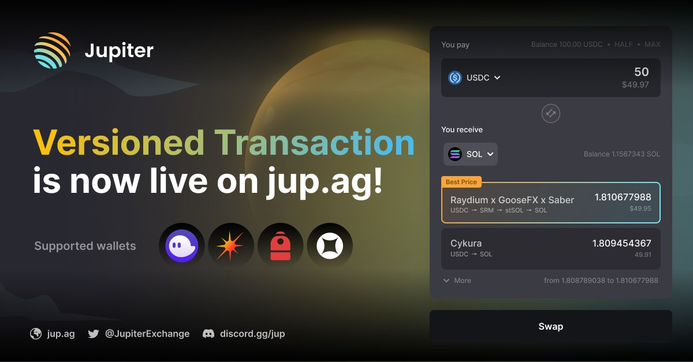

# Use Versioned Transaction with Jupiter




***Jupiter's latest V4 API improves composability by utilizing Solana's Versioned Transactions and Address Lookup Tables so all Jupiter routes can be done in a single transaction.***

For anyone developing on Solana one of the biggest hurdles to composing protocols has been dealing with the transaction size limit of 1232 bytes.  Given each account takes 32 bytes and each signature takes 64 bytes it is easy to hit the transaction size limit often.  For Jupiter, this meant that we were limited to two-hop swaps and we used up all the transaction size just to fit the two swaps in a single transaction.  Other instructions that were needed (e.g. ATA creation or wrapping SOL) had to be done in a separate setup and cleanup transaction making Jupiter harder to compose with.

<details>
<summary><b>Summary of constraints that affect composability</b></summary>
<ul>
<li><b>transaction size</b> is limited to 1232 bytes.  </li>
<li><b>compute budget</b> is defaulted to 200k compute units with a max of 1.4M compute units. If you exceed the compute budget, your transaction will be halted.  Most programs have designed their compute budget to take up 200k which you can use to estimate your compute budget. However, many programs do not have an upper bound on their compute budget and it's possible for them to exceed the limit.  Jupiter transactions request the full 1.4M to accommodate some of these programs as best as possible.</li>
<li><b>cross-program invocations</b> are limited to 4 levels</li>
<li><b>stack usage</b> can not exceed 4k </li>
<li><b>BPF call depth</b> can not exceed 64</li>
</ul>
Get more details from the <a href="https://docs.solana.com/developing/programming-model/runtime">Solana runtime</a>.
</details>

By utilizing Versioned Transactions with Address Lookup Tables, all Jupiter swaps can now be done in a single transaction with ~50% of the transaction size freed for anyone to add their own instructions to.

## What are Versioned Transactions?

[Versioned Transactions](https://docs.solana.com/developing/versioned-transactions) are the new transaction format that allows for additional functionality in the Solana runtime, including [Address Lookup Tables](https://docs.solana.com/developing/lookup-tables).  Address Lookup Tables let you store the account addresses in on-chain tables instead of being stored directly in the transaction which will free up space for other instructions.

:::info You do not need to use Address Lookup Tables to compose with Jupiter.
We automatically construct the transactions to use the correct Jupiter lookup tables for you.  However, using your own on-chain lookup tables will allow you to fit more instructions into the transaction.
:::

## Example:  Add your own fixed referral fee to Jupiter transactions

:::tip You can easily add a custom referral fee with `feeBps`, check out [Adding Your Own Fees](./).
:::

**1. Get the Jupiter swap transaction from the API.**

You can refer to the example code in Using the API for retrieving a Jupiter swap transaction.

```js
// Some more imports you will need
import { TransactionMessage, VersionedMessage, TransactionInstruction, sendAndConfirmRawTransaction, SystemProgram, AddressLookupTableAccount } from '@solana/web3.js';
import { ASSOCIATED_TOKEN_PROGRAM_ID, Token, TOKEN_PROGRAM_ID } from '@solana/spl-token';

// public key to use for this example
const referralWalletPublicKey = new PublicKey("referral_wallet_public_key")
```

**2. Deserialize the transaction**

```js
// deserialize the transaction
const swapTransactionFromJupiterAPI = swapTransaction
const swapTransactionBuf = Buffer.from(swapTransactionFromJupiterAPI, 'base64')
var transaction = VersionedTransaction.deserialize(swapTransactionBuf)
// console.log(transaction)
```

**3. Construct the referral fee transfer instruction**

```js
// construct the transfer instruction
const transferInstruction = SystemProgram.transfer({
    fromPubkey: wallet.publicKey,
    toPubkey: referralWalletPublicKey,
    lamports: 1000,
  }),
```

**4. Fetch the Address Lookup Table accounts**

This will be needed to decompile and compile the transaction message.

```js
// get address lookup table accounts
const addressLookupTableAccounts = await Promise.all(
  transaction.message.addressTableLookups.map(async (lookup) => {
    return new AddressLookupTableAccount({
      key: lookup.accountKey,
      state: AddressLookupTableAccount.deserialize(await connection.getAccountInfo(lookup.accountKey).then((res) => res.data)),
    })
  }))
// console.log(addressLookupTableAccounts)
```

**5. Decompile the transaction message and add the transfer instruction**

```js
// decompile transaction message and add transfer instruction
var message = TransactionMessage.decompile(transaction.message,{addressLookupTableAccounts: addressLookupTableAccounts})
message.instructions.push(transferInstruction)
```

**6. Compile the new message and update the transaction**

```js
// compile the message and update the transaction
transaction.message = message.compileToV0Message(addressLookupTableAccounts)
```

**7. Sign and send the transaction**

```js
// sign the transaction
transaction.sign([wallet.payer])

// Execute the transaction
const rawTransaction = transaction.serialize()
const txid = await sendAndConfirmRawTransaction(connection, Buffer.from(rawTransaction), {
  skipPreflight: true,
  commitment: 'confirmed',
  maxRetries: 2
})
console.log(`https://solscan.io/tx/${txid}`)
```

## Using your own Address Lookup Tables

If you'd like to use your own address lookup tables, you just need to append your tables to the address lookup table accounts

```js
// ...
addressLookupTableAccounts.push(yourAddressLookupTableAccounts)
// ...
```

:::tip Resources for creating and using Address Lookup Tables
- [Github docs on versioned transactions](https://github.com/solana-labs/solana/blob/master/docs/src/developing/versioned-transactions.md)
- [Github docs on address lookup tables](https://github.com/solana-labs/solana/blob/master/docs/src/developing/lookup-tables.md)
- [Phantom's guide for sending a versioned transaction](https://docs.phantom.app/getting-started-with-solana/sending-a-transaction-1)
:::