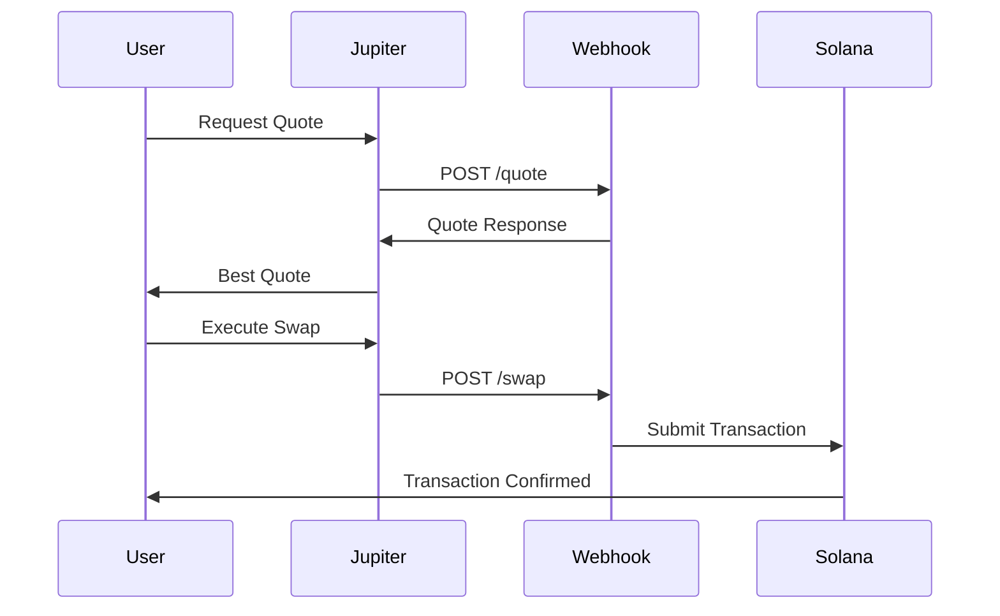

<head>
    <title>Jupiter RFQ Integration Overview</title>
    <meta name="twitter:card" content="summary" />
</head>

# Integration Overview

This section provides comprehensive guidance for market makers looking to integrate with Jupiter's RFQ system. The integration involves setting up webhook endpoints that can handle quote requests and swap executions.

## Architecture Overview

The following diagram illustrates the request workflow:



## Webhook Endpoints

Your webhook must implement three main endpoints:

### Required Endpoints

- **`GET /tokens`** - List supported token pairs
- **`POST /quote`** - Provide quotes for token swaps  
- **`POST /swap`** - Execute verified swaps

### Base URL Registration

When registering with Jupiter, you'll provide a base URL like:
```
https://your-api-endpoint.com/jupiter/rfq
```

Jupiter will then call:
- `GET https://your-api-endpoint.com/jupiter/rfq/tokens`
- `POST https://your-api-endpoint.com/jupiter/rfq/quote`
- `POST https://your-api-endpoint.com/jupiter/rfq/swap`

## Key Requirements

### Response Time
- **Quote requests**: Must respond within **250ms**
- **Swap requests**: Must respond within **25 seconds**

### Fulfillment Rate
- Market makers must maintain a **95% fulfillment rate**
- Falling below 95% in a 1-hour window will result in temporary suspension

### API Authentication
If your webhook requires authentication, provide an API key during registration. Jupiter will include it as the `X-API-KEY` header in all requests.

## Next Steps

1. **[Webhook Implementation](./webhook-implementation)** - Learn how to build your webhook endpoints
2. **[API Specifications](../api/overview)** - Detailed API documentation
3. **[Testing](../testing/overview)** - Validate your implementation
4. **[Deployment](./deployment)** - Production deployment guidelines
