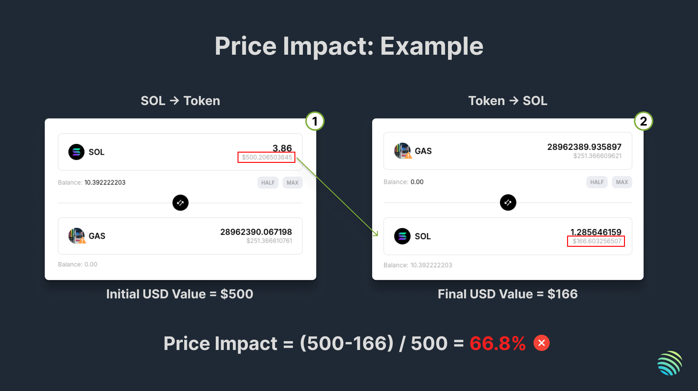

<head>
    <title>Swap Guide: Add Token to Jupiter</title>
    <meta name="twitter:card" content="summary" />
</head>

All tokens can be found on Jupiter, tokens that aren't verified are marked with a ⚠️ warning label, encouraging users to double-check mint addresses before trading. If you've created a token and want it verified on the Jupiter Ecosystem List, this guide will walkthrough the requirements.

Tokens with liquidity pools that meet our liquidity requirement can be traded, if you have created a liquidity pool and want it to be routed on Jupiter, this guide will walkthrough the liquidity check.

---
## How to Get Your Token Verified

**Step 1: Visit the Submission Portal:**

Head over to [**catdetlist.jup.ag**](https://catdetlist.jup.ag/) to submit your token for review.

**Step 2: Ensure Your Project Meets the Requirements:**

To qualify for verification, your token must meet the following criteria:

- **Age:** At least 21 days old.
- **Daily Volume:** More than $10,000 in trading volume.
- **Market Cap:** Exceed $100,000.
- **Unique Metadata:** Ensure the token's symbol and name are unique and not duplicates of existing projects.
- **Unique Holders:** Have more than 500 unique holders.

:::warning Trade Without Verification
Your token doesn’t need to be verified to be tradable. Most new liquidity pools are supported for instant routing for 14 days. Afterward, pools are re-evaluated periodically.
:::

:::tip Encourage Safe Trading
Remind your users to search using your **mint address** to ensure safe swaps.
:::

:::tip Reach out for assistance
If you face any issues or have questions, feel free to [reach out to the community's token list channel on our Discord](https://discord.com/channels/897540204506775583/1076158397570875473).

Do take note that the team and community members face large traffic of token listings everyday, we greatly appreciate your patience and we'll continue to look for ways to improve the process.
:::

**Learn More About the Community Tag Initiative**

Explore these resources to better understand the verification process:

- 🌐 **Community Tag Application Site:** [catdetlist.jup.ag](https://catdetlist.jup.ag/)
- 📖 **Community Tag FAQ:** [FAQ Page](https://www.jupresear.ch/t/faq-jupiter-community-tag/23074)
- 🏷️ **Community Tag Overview:** [Overview Post](https://www.jupresear.ch/t/get-your-token-a-community-tag/18963)
- 📊 **Token API:** [Token API](https://station.jup.ag/docs)

## How to Get Your Pool Routed on Jupiter

To provide users access to new tokens, all new markets on supported AMMs are instantly routed for 14 days.

After 14 days, markets that fit the criteria will continue to be routed on Jupiter.

:::tip Supported AMMs
We currently support Fluxbeam, Meteora DLMM, Meteora CPMM, 1Intro, Pump.Fun, Raydium CLMM, Raydium CP, Raydium V4 and Whirlpools for Instant Routing.
:::

To ensure your market gets routed on Jupiter after 14 days, your market must fit one of the following criteria:

**1. Less than 30% price impact on $500**

Using a benchmark position size of $500, a user should encounter less than 30% price impact after swapping in AND out of the token from the same pool.

```
Price Impact = ($500 - Final USD value) / $500
```

For example, a user swaps $500 worth of SOL into the token, then swaps the same output amount back into SOL. We then use the formula to calculate the price impact percentage.

If the price impact is more than 30%, it means that there is insufficient liquidity in the pool for the benchmark position size of $500.



***2. (For additional markets) Less than 20% price difference on new pools***

For additional markets on already supported tokens, there should be a variance of less than 20% between the new pool and the pool existing in routing.