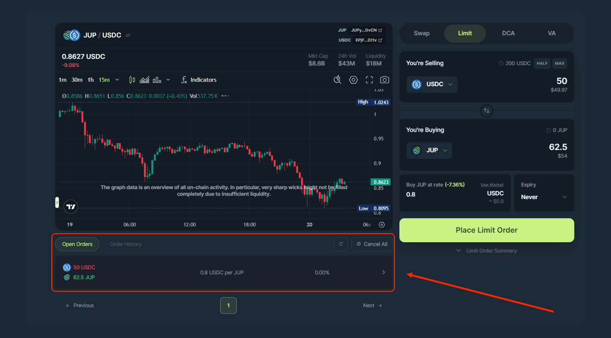
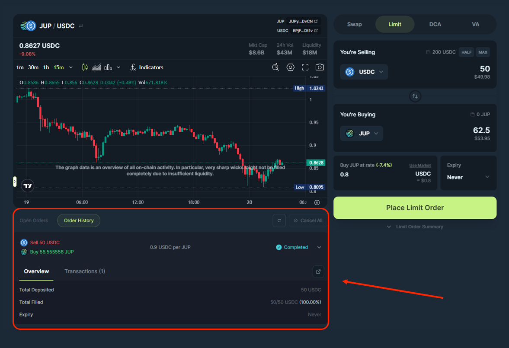

<head>
    <title>Manage Trigger Order</title>
    <meta name="twitter:card" content="summary" />
</head>

Jupiter makes it easy to manage multiple Trigger Orders seamlessly, whether you trade multiple tokens or rates. This guide will walk you through how to manage them with the interface.

---

## Create New Trigger Order

Simply create a new order just like you did before! If you’re starting out, head over to this [guide](./how-to-create-trigger-order)!

## View Open Orders

Once you have created your order, it will automatically populate on the dashboard and you can view all your **Active** Trigger Orders as well.

1. Navigate to the “Open Orders” section.
2. Here you will see all your active Trigger Orders.

This section shows the orders which are submitted to the system but they are yet to be executed as the target price is not yet reached.

### Understand The Details

To dive deeper into each item of the Active Order interface, refer to the [Trigger Order Interface page](./interface)!

### Close and Withdraw

Use the button in your active Trigger Order to cancel and close the order. This will close the order account and send you back the amount left (full if not filled at all or some if partially filled) and rent.

:::tip cancel all orders
If you have multiple active orders, you can use the `Cancel All` button to close all of them.
:::

## View Order History

Orders that are **Completed** or **Cancelled** (either partially filled or not filled at all) are shown here.

