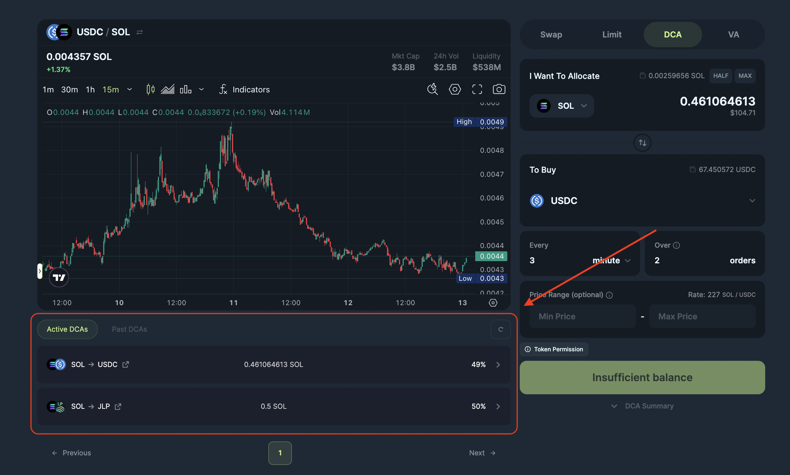
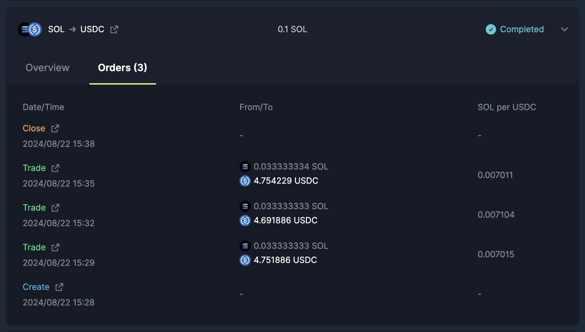

<head>
    <title>Manage Recurring Orders</title>
    <meta name="twitter:card" content="summary" />
</head>

Jupiter makes it easy to manage multiple Recurring Orders seamlessly, whether you’re diversifying your portfolio or optimizing investments for different tokens. This guide will walk you throughhow to manage them and the interface.

---

## Create New Recurring Order

Simply create a new Recurring Order just like you did before! If you’re starting out, head over to this [guide](./how-to-create-recurring-order)!

## View Active Recurring Order

Right on the dashboard you can view all your active Recurring Orders.

1. Navigate to the “Active Recurring Orders” section.
2. Here, you’ll see a list of all your active Recurring Orders.

### Understanding The Details

Each plan in the “Active Recurring Order” section will display key details to help you track progress. [Refer to Recurring Order Interface guide to see the full breakdown of the details](./interface#activehistorical-recurring-order).

1. **Active Recurring Orders:** This tab lists out all of your active Recurring Orders.
2. **Individual Recurring Orders:** Ongoing Recurring Orders with a percentage to indicate how much of the Recurring Order has been executed.
3. **Order Details:** To see the entire Recurring Order details, expand by clicking one of your ongoing Recurring Orders.
4. **Balance Summary:** This shows the Recurring Order balance progress where you can track the balances for the tokens you allocated, you are buying and you have withdrawn.
5. **Order Summary:** This will show the current ongoing Recurring Order, with information like:

### Close and Withdraw

Use the button in your active Recurring Order to cancel and close the Recurring Order. This will halt the progress on the Recurring Order and withdraw all funds in the order to your wallet.

:::note
The previously completed purchases should have sent the tokens into your wallet upon each purchase, unless you have closed your ATA (Associated Token Account) which you may bulk withdraw them when you cancel and close the Recurring Order.
:::

## View Recurring Order History

This tab lists all Recurring Orders that have been completed or canceled. Each past plan will display:

- The same Recurring Order details as stated above.
- Status (completed or canceled).

Once you select a Past Recurring Order, you can view all the transactions for your Recurring Order.

## View Recurring Order Transactions

A Recurring Order can be made up of multiple transactions, such as the order creation transaction, multiple purchase transactions and the order close transaction. [Refer to Recurring Order Interface guide to see the full breakdown of the details](./interface#recurring-order-orders).

In order to view each order's transactions, click on one of your orders and head over to the **"Orders"** tab.

