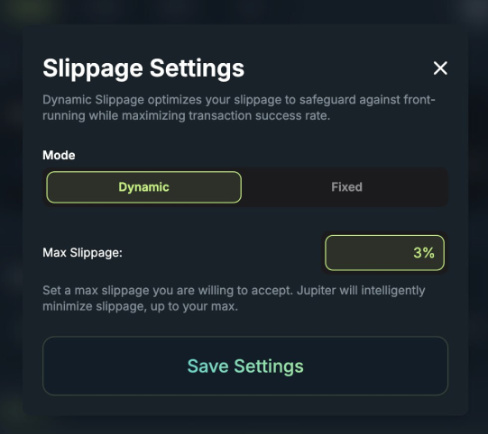
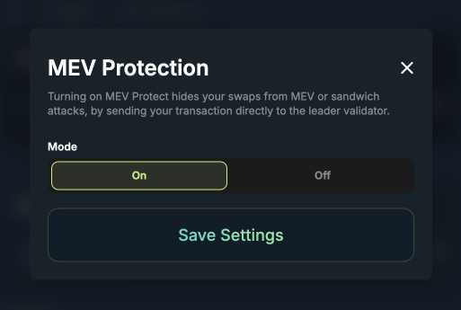

<head>
    <title>Understanding Jupiter Swap: Smart Routing & Features</title>
    <meta name="twitter:card" content="summary" />
</head>

The Jupiter Swap is a decentralized exchange aggregator designed to provide the best rates for swapping SPL tokens on the Solana blockchain. It routes trades through multiple liquidity sources to ensure optimal prices, low slippage, and efficient transaction execution. Users benefit from its seamless interface, deep liquidity, and the ability to perform complex token swaps in a single transaction.

### **Jupiter V3 Upgrades**

Jupiter V3 introduced multiple improvements to the swap experience! 

The Metropolis upgrade introduced Instant Routing, Dynamic Slippage, Smart Token Filtering, Ecosystem Token List and new Safety features.
[Dive into these new features in detail here! ->](/guides/2-jupiter-spot/2-jupiter-swap/2-how-swap-works/1-metropolis.md)

Metis, a routing protocol, was also introduced to improve route discovery, reducing slippage and scalability in V3.
[Dive into key features of the Metis routing protocol here! ->](/guides/2-jupiter-spot/2-jupiter-swap/2-how-swap-works/3-metis-routing.md)

### Token Ledger For Increased Swap Success Rates

The Token Ledger is a collection of three instructions *(Set Token Ledger, Send Instruction, Swap Instruction)* that consolidate withdrawal and swap instructions into a single transaction. Integrators/partners can now effortlessly instruct a swap to be executed based on the actual sent amount, after taking into account fees and slippages.

Before the introduction of the Token Ledger, swap instructions relied on a simulation-driven approach to approximate the amount deducted from a user's wallet to facilitate the swap. This estimation approach often ended up with discrepancies between the estimated and actual amounts, especially during periods of market volatility with high slippages, leading to swap failures.

Consider this scenario where a user intends to withdraw 1,000 USDC from Meteora’s USDC vault into wBTC. Note that users hold vUSDC LP tokens in Meteora vaults.

1. In the first instruction, the Token Ledger will verify and record the user’s initial USDC balance within their wallet. For the purpose of this example, let’s assume the initial balance is 100 USDC.
2. In the second instruction, an amount equivalent to 1,000 USDC in vUSDC is withdrawn from Meteora vaults into USDC, and we examine the user’s balance. Due to factors like slippage, the USDC balance is found to be 1090 USDC.
3. For the third instruction, subtracting the initial 100 USDC from the current 1090 USDC balance, it’s evident that the user has effectively withdrawn 990 USDC, which will then be utilized to swap for wBTC as the final output token.

Without the Token Ledger, the previous swap method relied on estimated amounts, which could fluctuate due to market volatility and performance variations, frequently resulting in suboptimal user experiences.

With the Token Ledger, integrators can issue swap instructions based on actual amounts that have taken into account slippage and related fees. This eliminates the need for simulation and significantly increases the success rate of swaps, all within a single transaction.

The Token Ledger caters to a wide range of use cases, which include but are not limited to:

- Withdrawing assets from a protocol to any desired token, such as converting to USDC from a wBTC vault.
- Supporting protocols that transition positions to a different token from their original position, as seen in Perpetuals.
- Facilitating the exchange of NFTs for tokens other than SOL.

Read more about the Token Ledger:
https://station.jup.ag/docs/apis/swap-api#using-token-ledger-instruction

## Safety Notifications

:::info UI Notifications
Jupiter offers several information signals to help users make informed trading decisions and protect themselves from potential losses. We will explain the difference between price impact, slippage, and price warnings below.
:::

### Price Impact

Price impact refers to the change in an asset's price due to the execution of a trade. This is especially relevant in decentralized exchanges (DEXs) or automated market makers (AMMs) due to their liquidity model.

Price Impact is influenced by the available liquidity to settle the trade and the size of the trade. For example, if you want to swap a large amount of one token for another in a liquidity pool, the larger your trade compared to the pool's size, the more significant the price impact will be. This is because the execution of your trade will shift the balance between the tokens in the pool which will directly affect the price according to the AMM's formula.

Price impact numbers vary across AMMs and the figure shown on Jupiter is an aggregate based on your particular route.

To reduce price impact, users can split trades into several smaller trades over time. Jupiter's smart routing system checks all available liquidity pools to find the optimal route that maximizes output tokens.

Be sure to check the minimum amount of destination tokens quoted on the Jupiter interface, and set a Slippage amount to protect yourself.

### Slippage

Slippage occurs when market conditions change between transaction submission and verification. The slippage rate is an important setting to prevent users from receiving fewer tokens than expected. If the price falls below the slippage rate, the transaction fails.

### MEV Protection

Jupiter makes it easier for you to protect your swap transactions against MEV and sandwich attacks by turning on the **"MEV Protect"** setting. Read more about how it works [here](https://www.jupresear.ch/).

### Price Warning

Price Warning is an additional layer of protection implemented by Jupiter to alert users when the quoted price deviates from the reference price (in this case, CoinGecko's pricing). Price warnings can be caused by various external factors, and Jupiter adds an extra confirmation layer to prevent misclicks or human errors.

### Verification Warning

Verification Warnings are shown for tokens that haven’t been approved by the community and added to the Jupiter Strict List. Scammers often create fake tokens with names identical to legitimate ones, attempting to deceive users into purchasing these fraudulent tokens.

### Freeze Authority

Freeze Authority (FA) is a control mechanism that allows token issuers to temporarily or permanently halt the transfer or trading of a token. This can be used for both legitimate and harmful purposes.

**Valid Uses of FA:** It is common for regulated tokens, such as stablecoins or RWAs, to have FA to comply with legal requirements. It allows stablecoin and RWA issuers to freeze tokens in cases of fraud, money laundering, terrorism financing, or to comply with law enforcement requests.

**Misuse of FA:** However, FA is most commonly used by scam projects. FA is often abused to lock users out of trading or transferring the scam token, leading to significant losses. It’s a red flag for users, as it indicates a potential for market manipulation or outright fraud.

**Freeze Authority Notifications for Unverified vs. Verified Tokens**

Tokens not on the Jupiter Strict List will display a full FA warning. Tokens verified by the community and approved for the Jupiter Strict List will display a less ominous FA notification.

Users should always assess the presence of FA in a project regardless of verification status and understand the intent behind it. While it can be necessary for stablecoin and RWA projects, more often than not it is used to exploit users.

#### Additional Safety Confirmation

When price impact or price deviation is too high, we have an additional modal asking you to confirm the trade.

## Swap Tips

- **Always double check the token mint address:** Token metadata such as name, symbol, and icon can be faked. The true identity of a token is its mint address.
  - [Tweet: A gentle reminder to check the mint address of the token you're trading](https://twitter.com/JupiterExchange/status/1580217415593443329?s=20&t=xmsYmPnUZfuS6tQpvEQ7Pg)
- **The quote given is not the final price:** The quote given on a route is based on the current liquidity in the pools. Pool liquidity can go up or down at any time and in some cases, pools may close. An example would be oracle-based Lifinity which may stop accepting swaps after a price movement.
- **Set a slippage amount to protect yourself:** Slippage is your swap protection if the price diverges too much from the quoted price.
- **Jupiter cannot guess the final spot price or know what is a reasonable price impact for you**. We encourage checking these before the swap:
  - Check the Price Impact. *Price impact varies across the AMM and DEXes that Jupiter uses in each route.*
  - Check against a price feed like [Coingecko](https://www.coingecko.com/), [Birdeye](https://birdeye.so/), or CEX pricing.
