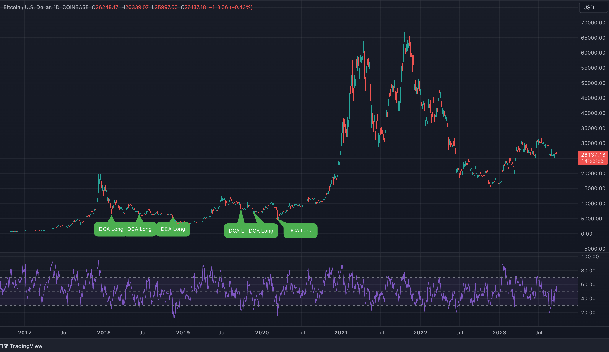

<head>
    <title>Jupiter DCA Explainer and Use Cases | Jupiter Station</title>
    <meta name="twitter:card" content="summary" />
</head>

.png)

## What is Dollar Cost Averaging (DCA)?
Forecasting whether prices have reached their peak or bottomed out in the short term is one of the most challenging aspects of asset investment. Rather than committing a lump sum in a single transaction, which carries the risk of purchasing near the peak, employing a Dollar-Cost Averaging (DCA) strategy allows you to spread out your investment over time. This helps to smooth out your overall cost, consequently lowering your cost basis. This, in turn, reduces potential losses while enhancing your profitability over the long run.

If you have confidence in the value of an asset, adopting a DCA approach proves to be an effective method for gradually accumulating it over time.

## How DCA works?
Dollar-Cost Averaging (DCA) is a straightforward yet powerful strategy that involves dividing your capital into multiple smaller orders over a fixed interval and period of time rather than placing a single large order. Jupiter's DCA automates these orders for you.

## When to DCA?
### Bear Market Accumulation
While forecasting short-term price movements can be challenging, identifying a bear market is comparatively more straightforward. Given the near impossibility, if not extreme difficulty, of attaining 100% certainty about a price bottom, a prudent approach is to stagger your orders over a period (e.g., making purchases weekly for the next six months). This strategy aims to average out your entry price during a bear market, potentially yielding substantial gains once a bull market resurgence occurs.

Here's an example with the oldest cryptocurrency - BTC in the prior (2018~2019) bear market:
1. When the price has dropped more than 50%, it's fairly easy to say that we are in a bear market
1. Once that occurs, let's, for illustration purposes, try to further optimize our strategy by looking at daily RSI - start a daily DCA over 7 days whenever RSI goes below 30
1. Our average price would have been approximately USD 6,000 / BTC
1. Fast forward to September 2023, we are still up a whopping 4x despite BTC prices dropping from +/- USD 64k

\* *The upper candle stick chart indicates price, the lower line chart indicates RSI.*

**Why not perform a market order when RSI < 30?**

Based on historical data, prices can still go further lower when RSI is below 30. Buying a single lump sum back in 2018 would still be profitable today. However, going all-in the very first time RSI dipped below 30 would have resulted in an average price of around USD 7,500. Additionally, this approach would have entailed grappling with the psychological impact of a >50% capital loss when BTC ultimately hit its low at approximately USD 3,000+. In contrast, employing a Dollar-Cost Averaging (DCA) strategy would have significantly reduced those losses, ultimately improving the beta (volatility in relation to return) of your portfolio.

### Bull Market Profit Taking
In the example above, we took no profit during the 2021-2022 bull market. It's worth noting that Dollar-Cost Averaging (DCA) is not limited to just bear markets, if you started accumulating during the bear market, it's prudent to realize profits during a bull market. Nevertheless, even in a bull market, the challenge persists: discerning the peak is no easy feat. Instead of selling your entire position all at once and potentially missing out on substantial gains if BTC prices surge another 200%, you can opt to sell over a span of time.

Using DCA to take profit during bull markets and accumulate during bear markets are some of the best ways to grow your wealth somewhat passively as a longer term investor. Just be sure to research on the right coin / token / asset to invest in. It may also be prudent to further diversify your investable capital to multiple coins / tokens / asset classes.

### Splitting up large orders
Executing market orders, whether through decentralized or centralized exchanges, can lead to negative price impacts, particularly in times of exceptionally low liquidity or with a substantial capital. This is where Dollar-Cost Averaging (DCA) proves invaluable. By spreading your order over a period, you exert less buying / selling pressure on the market, ultimately securing a more favorable average price. With Jupiter's DCA, you have the flexibility to divide your orders down to intervals as short as 1 minute. In essence, this transforms into a variation of a TWAP (time-weighted average price) strategy, a method frequently utilized by major investors to strategically accumulate / dispose assets.

### Selling tokens with low liquidity
Tokens with low liquidity levels pose a challenge when it comes to selling, as doing so can create significant downward price pressure, leading to larger losses than necessary. Employing a Dollar-Cost Averaging (DCA) strategy can alleviate this issue by spreading out your selling activity, thereby reducing the overall selling pressure and potentially boosting your returns.
