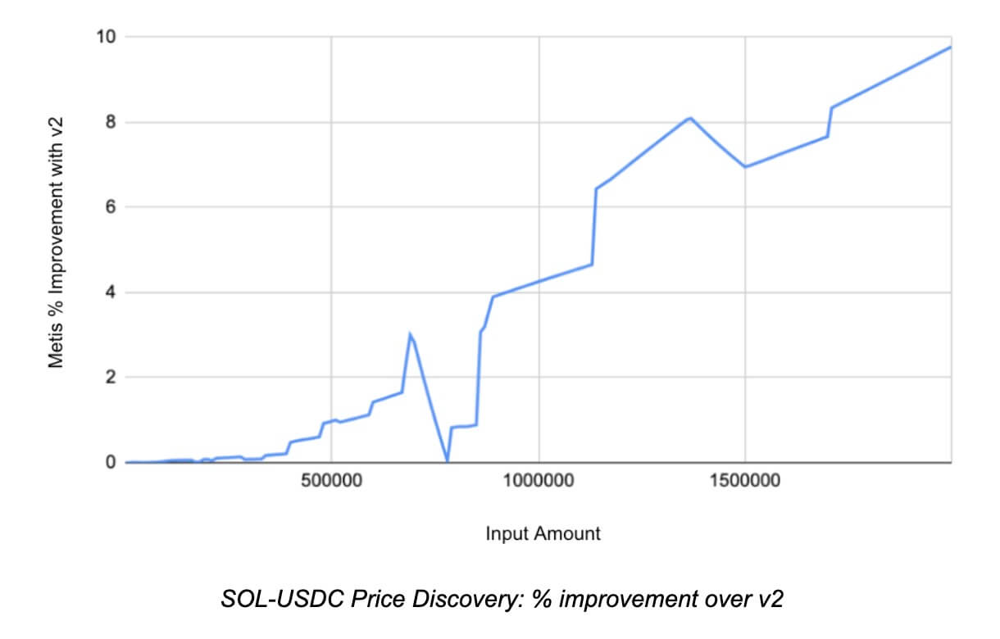
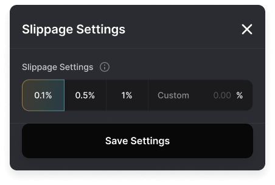

<head>
    <title>How Swap Works</title>
    <meta name="twitter:card" content="summary" />
</head>

The Jupiter Swap is a decentralized exchange aggregator designed to provide the best rates for swapping SPL tokens on the Solana blockchain. It routes trades through multiple liquidity sources to ensure optimal prices, low slippage, and efficient transaction execution. Users benefit from its seamless interface, deep liquidity, and the ability to perform complex token swaps in a single transaction.

## [**Metis**](https://en.wikipedia.org/wiki/Metis_(moon))

On Jupiter, swaps are powered by our advanced routing algorithm, Metis, introduced in Jupiter v3.

Metis is a heavily modified variant of the [Bellman-Ford algorithm](https://en.wikipedia.org/wiki/Bellman%E2%80%93Ford_algorithm) catered for the key requirements of offering best price routing at scale in a very dynamic operational space.

### Metis Routing

Metis enhances our industry-leading aggregator by improving route discovery for all trading pairs, reducing slippage for large trades, and offering scalable solutions in preparation for upcoming Solana upgrades and new DEXs.

Metis is designed to operate seamlessly on Solana’s hyper-fast blocktimes, supported by major improvements to our backend infrastructure. This ensures that trades are executed quickly and efficiently, even under high demand.

In addition to Metis, Jupiter offers several other features to enhance your trading experience. The Dollar-Cost Averaging beta allows for systematic investment strategies, while a new contract eliminates the need for users to maintain intermediate token accounts. We’ve also integrated Limit Orders into our routing system, providing more control over your trades.

The Jupiter space station is another innovation, along with several new features based on user feedback. These upgrades, coming just a few months after v2, demonstrate our commitment to pushing the boundaries of Solana and providing a powerful, user-friendly trading platform.

With these enhancements, Jupiter aims to be a genuine CEX replacement, facilitating the migration to decentralized platforms with ease and efficiency.

Dive into the details below.

### Key Features

### Incremental Route Building

To find the best price, Metis streams the input tokens to incrementally build a route to split and merge at any stage. By generating the routes for each split iteratively one after another, we can also use the same DEX in different splits - allowing us to find routes with better prices with more complex trades.

### Combine Route Generation and Quoting

To improve the efficiency of the algo, we combine route generation and quoting into a single step, allowing us to avoid generating and using bad routes, which besides improving the efficiency, also allows us to use a larger set of tokens as intermediaries.

### Future Proofing

v2 runs fast when the total number of DEXs used is small since Solana limits us to use at most 4 DEXs in a swap *(due to the account lock limit of 64)*. Future Solana upgrades will relax this limit and allow more DEXs to be used in a single transaction. In addition, we foresee the continued growth of the Solana DeFi ecosystem, which means there will be many more DEXs emerging.

Metis(v3) is equipped to handle both of these trends, since the algorithm is able to scale to include more DEXs in a route when account lock limits are increased, and can support more DEXs with only a modest increase in running time.

### Performance Improvements

Metis is able to refresh quotes in parallel and in real time. Compared to v2, metis on average quotes prices that are 5.22% better. These imporivements increase sharply based on the trade size.

### Token Ledger For Increased Swap Success Rates

The Token Ledger is a collection of three instructions *(Set Token Ledger, Send Instruction, Swap Instruction)* that consolidate withdrawal and swap instructions into a single transaction. Integrators/partners can now effortlessly instruct a swap to be executed based on the actual sent amount, after taking into account fees and slippages.

Before the introduction of the Token Ledger, swap instructions relied on a simulation-driven approach to approximate the amount deducted from a user's wallet to facilitate the swap. This estimation approach often ended up with discrepancies between the estimated and actual amounts, especially during periods of market volatility with high slippages, leading to swap failures.

Consider this scenario where a user intends to withdraw 1,000 USDC from Meteora’s USDC vault into wBTC. Note that users hold vUSDC LP tokens in Meteora vaults.

1. In the first instruction, the Token Ledger will verify and record the user’s initial USDC balance within their wallet. For the purpose of this example, let’s assume the initial balance is 100 USDC.
2. In the second instruction, an amount equivalent to 1,000 USDC in vUSDC is withdrawn from Meteora vaults into USDC, and we examine the user’s balance. Due to factors like slippage, the USDC balance is found to be 1090 USDC.
3. For the third instruction, subtracting the initial 100 USDC from the current 1090 USDC balance, it’s evident that the user has effectively withdrawn 990 USDC, which will then be utilized to swap for wBTC as the final output token.

Without the Token Ledger, the previous swap method relied on estimated amounts, which could fluctuate due to market volatility and performance variations, frequently resulting in suboptimal user experiences.

With the Token Ledger, integrators can issue swap instructions based on actual amounts that have taken into account slippage and related fees. This eliminates the need for simulation and significantly increases the success rate of swaps, all within a single transaction.

The Token Ledger caters to a wide range of use cases, which include but are not limited to:

- Withdrawing assets from a protocol to any desired token, such as converting to USDC from a wBTC vault.
- Supporting protocols that transition positions to a different token from their original position, as seen in Perpetuals.
- Facilitating the exchange of NFTs for tokens other than SOL.

Read more about the Token Ledger:
https://station.jup.ag/docs/apis/swap-api#using-token-ledger-instruction

## Swap Tips

- **Always double check the token mint address:** Token metadata such as name, symbol, and icon can be faked. The true identity of a token is its mint address.
  - [Tweet: A gentle reminder to check the mint address of the token you're trading](https://twitter.com/JupiterExchange/status/1580217415593443329?s=20&t=xmsYmPnUZfuS6tQpvEQ7Pg)
  - [We provide a "strict" list mode, with a smaller set of validated tokens](/docs/get-your-token-onto-jup)
- **The quote given is not the final price:** The quote given on a route is based on the current liquidity in the pools. Pool liquidity can go up or down at any time and in some cases, pools may close. An example would be oracle-based Lifinity which may stop accepting swaps after a price movement.
- **Set a slippage amount to protect yourself:** Slippage is your swap protection if the price diverges too much from the quoted price.
- **Jupiter cannot guess the final spot price or know what is a reasonable price impact for you**. We encourage checking these before the swap:
  - Check the Price Impact. *Price impact varies across the AMM and DEXes that Jupiter uses in each route.*
  - Check against a price feed like [Coingecko](https://www.coingecko.com/), [Birdeye](https://birdeye.so/), or CEX pricing.

---

## Safety Notifications

:::info UI Notifications
Jupiter offers several information signals to help users make informed trading decisions and protect themselves from potential losses. We will explain the difference between price impact, slippage, and price warnings below.
:::

### Price Impact

Price impact refers to the change in an asset's price due to the execution of a trade. This is especially relevant in decentralized exchanges (DEXs) or automated market makers (AMMs) due to their liquidity model.

Price Impact is influenced by the available liquidity to settle the trade and the size of the trade. For example, if you want to swap a large amount of one token for another in a liquidity pool, the larger your trade compared to the pool's size, the more significant the price impact will be. This is because the execution of your trade will shift the balance between the tokens in the pool which will directly affect the price according to the AMM's formula.

Price impact numbers vary across AMMs and the figure shown on Jupiter is an aggregate based on your particular route.

To reduce price impact, users can split trades into several smaller trades over time. Jupiter's smart routing system checks all available liquidity pools to find the optimal route that maximizes output tokens.

Be sure to check the minimum amount of destination tokens quoted on the Jupiter interface, and set a Slippage amount to protect yourself.

### Slippage

Slippage occurs when market conditions change between transaction submission and verification. The slippage rate is an important setting to prevent users from receiving fewer tokens than expected. If the price falls below the slippage rate, the transaction fails.

### Price Warning

Price Warning is an additional layer of protection implemented by Jupiter to alert users when the quoted price deviates from the reference price (in this case, CoinGecko's pricing). Price warnings can be caused by various external factors, and Jupiter adds an extra confirmation layer to prevent misclicks or human errors.

#### Additional Safety Confirmation

When price impact or price deviation is too high, we have an additional modal asking you to confirm the trade.

