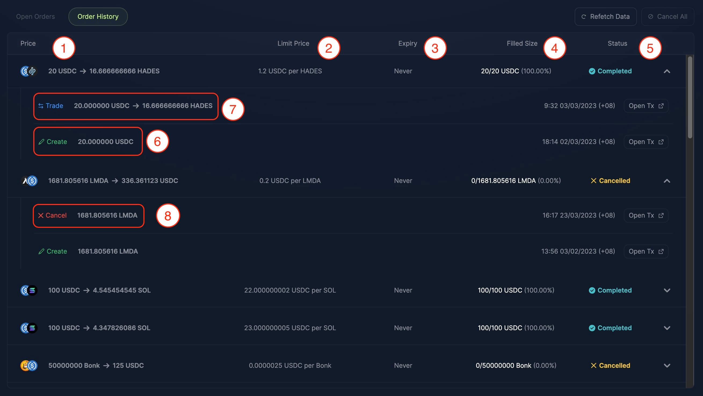

Jupiter Limit Order provides users with the simplest way to place limit orders on Solana and receive tokens directly in your wallet when the order is filled!

## How to place a Limit Order

1. **Input:** Pick a token from the token selector and specify the amount of token that you're selling.
2. **Rate/ Price:** Here you specify the rate / price that you're buying the output token (Or `Use Market` for the current market price)
3. **Expiry:** Set an expiry period for your order, from 10 minutes to Custom and even Never.
4. **Output:** Jupiter Limit Order will be able to compute your parameters and come up with the rate that you'll be getting.
5. **Place Order:** Once you've reviewed the summary of your order, you will be able to place order and submit the transaction over to Jupiter Limit Order.

## Open Order & Order History

### Open Order

Open Order section is where users keep track of submitted order/ transaction that has yet to be fulfilled.

1. **Order Info:** Order info specifies user's order from TokenA *(Selling)* to TokenB *(Buying)* and the amount for the order.
2. **Price:** Price is the rate that is being submitted for the order - When the on-chain price of the purchase token hits, order will be executed.
3. **Expiry:** Expiry period set by user when submitting the order - in this example it's `Never`, hence order will be on-chain until the price hits and be executed.
4. **Filled Size:** Filled size is the section to monitor the fulfillment size of the order. If it is an large order, and there is insufficient liquidity on-chain, Jupiter's keeper will try to execute partially, and continue monitoring on-chain price to fulfill the rest of the order. If order is fully executed, user will get the token directly in his wallet.
5. **Action:** Action is where user will be able to cancel and close their order/ position.

### Order History

Order History section is where users keep track of orders that have been completed or have been cancelled.

1. **Price:** Price is the rate that is being submitted for the order - When the on-chain price of the purchase token hits, order will be executed.
2. **Limit Price:** Limit Price is the single unit price for the order - X amount of TokenA per TokenB
3. **Expiry:** Expiry period set by user when submitting the order - in this example it's `Never`, hence order will be on-chain until the price hits and be executed.
4. **Filled Size:** Filled size is the section to monitor the fulfillment size of the order. If it is an large order, and there is insufficient liquidity on-chain, Jupiter's keeper will try to execute partially, and continue monitoring on-chain price to fulfill the rest of the order. If order is fully executed, user will get the token directly in his wallet.
5. **Status:** Status indicates the order state - Completed / Cancelled
6. **Action - Create:** This is the first transaction that is being submitted, creating the order of trade to submit on-chain.
7. **Action - Trade:** This is the actual trade transaction being executed when the on-chain price hits the specified price submitted by user.
8. **Action - Cancel:** This is the cancellation of the order/ trade, where funds/ tokens will be refunded back to wallet.