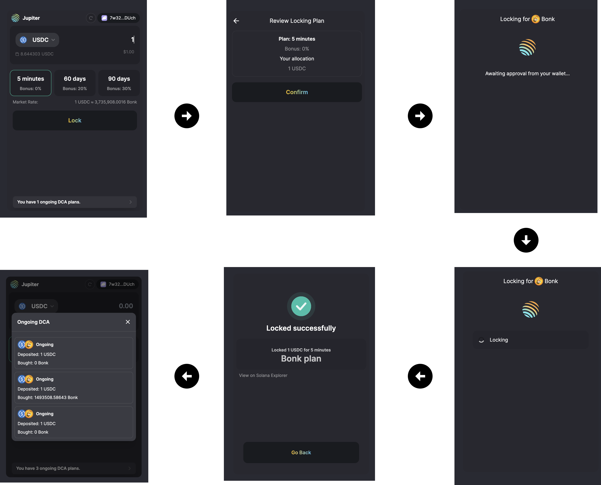

The Lock DCA example serves as a demonstration of DCA implementation using CPI, coupled with a practical use case of locking DCA for a specific duration.

Our aim is to simplify the process for our partners to inquire about and refer to the distribution of additional rewards and incentives when a user executes a DCA order and locks it for a predetermined period.

We've established distinct states to enable integrators to effortlessly inquire about these states and allocate rewards accordingly. Specifically, we've introduced an escrow account and a completion state that can be queried for verification purposes. This data can also serve as a reference point for our partners when planning future airdrops or incentive programs for users.

## Setting up

1. Adjust the parameters (Airdrops bps and Program id)
2. Fork and deploy the lock [DCA program]((https://github.com/jup-ag/dca-cpi-example)) with a new program id 
3. Customize the frontend with [scaffold skeleton UI](https://locked-dca.vercel.app/), GH repo for the UI - (https://github.com/TeamRaccoons/locked-dca) (Using your new program id)
4. Craft new plans for the campaigns - Plans are hardcoded on the Frontend, and enforce on the contract level.

```js
export const SECONDS_IN_MINUTE = 60; // 1 minute
export const SECONDS_IN_DAY = 86400; // 1 day
export const LOCKING_PLAN: ILockingPlan[] = [
  {
    name: `5 minutes`,
    incetivesPct: 0,
    cycleSecondsApart: SECONDS_IN_MINUTE, // executed per minute
    numberOfTrade: 5,
  },
  {
    name: `60 days`,
    incetivesPct: 20,
    cycleSecondsApart: SECONDS_IN_DAY,
    numberOfTrade: 60, // executed daily
  },
  {
    name: `90 days`,
    incetivesPct: 30,
    cycleSecondsApart: SECONDS_IN_DAY,
    numberOfTrade: 90, // executed daily
  },
];
```

5. Run the [airdrop script](https://github.com/jup-ag/dca-cpi-w-airdrop-example) with their airdrop private key (Using your new program id)



## Here's how it works

Once a DCA order is successfully executed, the DCA program concludes the transaction by closing the account and transferring all associated outputs to the user's wallet. However, the escrow account remains active, providing a means for verification and reference for future plans.

For our partners and integrators, we offer a scaffold skeleton UI for Lock DCA. This UI can be used as a foundation to design a customized user interface tailored to their specific requirements. Additionally, partners have the option to deploy their own version of the program or contract, incorporating the exact code along with a program address. This approach offers greater flexibility and customization possibilities to cater to future needs.

We also have an airdrop script readily available, which allows our partners to easily query all DCA orders and associated users for incentive programs.

### User flow

1. User create a DCA order via escrow with the partners or integrators.
2. DCA completes within the preset duration.
3. User will be able to navigate to the site and close their escrow and receive all of the executed DCA orders.
4. Once the order and escrow has been closed, partners and integrators will automatically airdrop rewards or incentives directly into user's wallet *(With the provided script running in a infinite loop in the background)*

- **Scaffold Skeleton UI for Lock DCA:**
    - **[Visit the Scaffold Skeleton UI](https://locked-dca.vercel.app/)**
    - **[Access the Repository on GitHub](https://github.com/TeamRaccoons/locked-dca)**
- **DCA Program:**
    - **[Explore the DCA Program on GitHub](https://github.com/jup-ag/dca-cpi-example)**
- **Airdrop Script:**
    - **[Check out the Airdrop Script on GitHub](https://github.com/jup-ag/dca-cpi-w-airdrop-example)**
