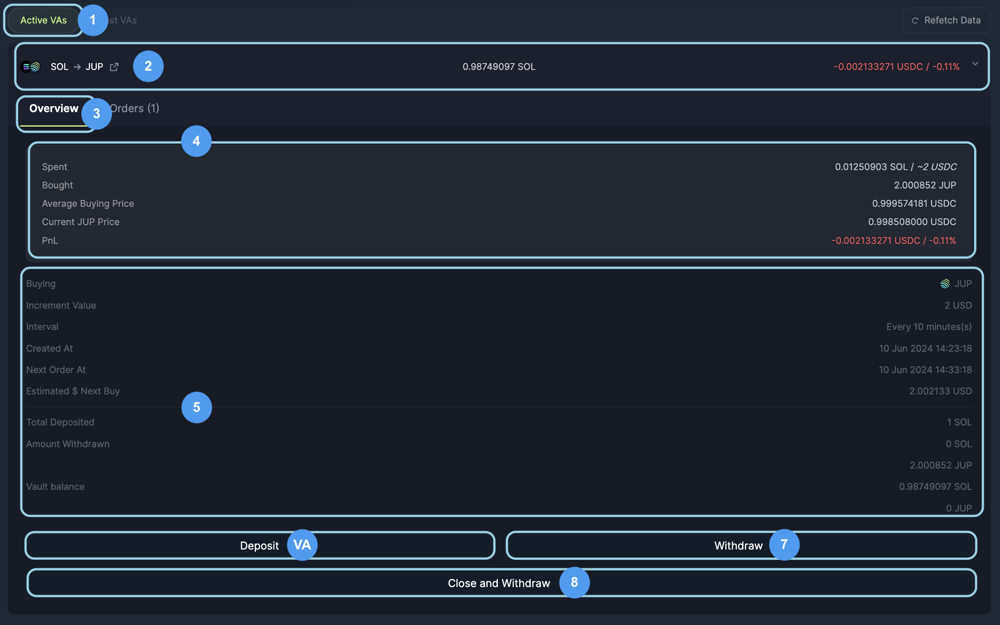
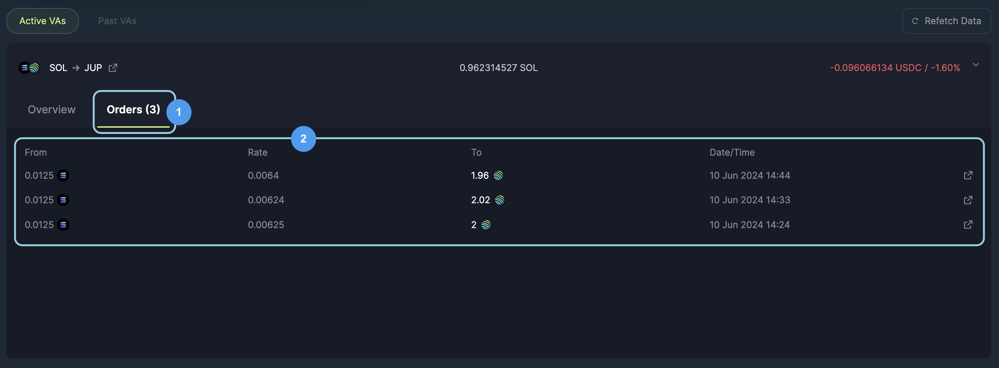
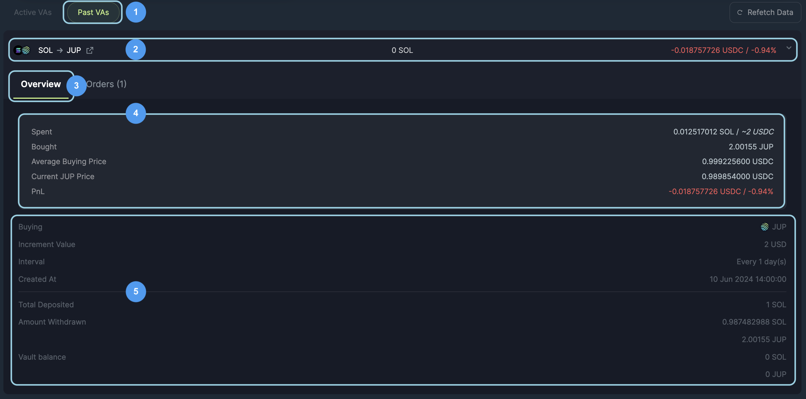

<head>
    <title>How to use Value Averaging (VA) on Jupiter</title>
    <meta name="twitter:card" content="summary" />
</head>

Value averaging (VA) is a strategy that works like dollar-cost averaging (DCA). It works similarly by making contributions in a consistent time period but differs by the amount of each contribution. VA focuses on equal growth of the portfolio instead of equal investments.

VA features the ability to react to market volatility and price action, in short, buying more tokens when price is low and buying less tokens when price is high. Check out this [Explainer Page](https://station.jup.ag/guides/va/explainer) to learn more about VA.

## Basic VA User Flow

1. First, navigate to the [Jupiter Website](https://jup.ag/) and then click on the `VA` icon below the top navigation bar. **Double check** that the URL in your search bar is correct: https://jup.ag/va/
2. Next, connect your wallet by clicking the `Connect Wallet` button in the upper right corner of the site.
3. Set the Amount (Increase Portfolio Value By) and the Duration (Every) for the VA orders.
**Do note** that the amount is based on how much of the total you want to increase by and not how much each contribution is
4. Select the token you want to buy and the token you are allocating (Max Budget) on the VA terminal.
5. Select between to Start Now or place the order in the future through Start At.
6. Select between to auto receive the bought tokens in your account or manually claim it.
7. Double check the order Summary details and if things look good, click the `Place Order` button.
8. Confirm the wallet notification and the VA order will be submitted to the system. 
9. A notification toast will appear in the lower left corner that will notify the user once the transaction has been sent and has completed.
10. Your new VA order will populate the Active VAs section below the Terminal once it is confirmed and the UI updates.
11. You can expand the Active VAs and inspect the progress of each VA, or view previously completed VAs in Past VAs.

**Let's go through the VA Settings in more detail below.**

---

## Jupiter VA Settings

1. **VA:** Select the VA tab in the product navigation menu to arrive at the VA terminal.
2. **Amount:** Specify the total value where your portfolio will increase by.
3. **Duration:** Specify the time freqency for the VA order with a numerical input and the dropdown selector.
4. **Output Token Selector:** Select the token that you are looking to buy.
5. **Input Token Selector:** Select the token you want to allocate or spend in your VA order.
6. **Input Field:** Enter the amount of the input tokens you want to allocate or spend in your VA order.
7. **Start Date:** Select between to start your VA order now or in the future.
8. **Receive Method:** Select between to automatically receive in your account or manually claim it  after every buy.
9. **Backtest Result Summary:** A summary is provided based on your inputs and historical data to calculate how much you would have spent and earned in a period.
10. **Backtest Result Values:** A breakdown of the backtest result summary:
    - Average Price - The average price of bought tokens across the period.
    - Total Bought - The total amount of tokens (output token) bought across the period.
    - Number of Buys - The amount of times an order is placed across the period.
    - Total Spent - The total amount of tokens (input token) spent or used to buy across the period.
    - Current Investment Value - The total value of your bought tokens (output token) at the current price.
    - PnL - The amount of Profit or Loss based on the difference between Total Spent and Current Investment Value.
11. **Order Details:** A breakdown of each backtest order when hovering over a circle:
    - Date - The date when the backtest order have bought.
    - Spent - The amount spent in the specific order.
    - Bought - The amount used to buy in the specific order.
    - Purchased Price - The value of the bought tokens at the specific time.
    - Cummulative Bought - The total amount bought since the start of the VA order.
    - Cummulative Spent - The total amount spent since the start of the VA order.
12. **Backtest Orders Graph Slider:** A sliding tool to inspect other backtest orders in the timeframe.
13. **Place Order:** Click to submit the VA instructions and start the VA.

### Active VAs

1. **Active VAs:** This tab lists out all of your active VA orders.
2. **Individual VA Orders:** On-going VAs with your current input token value and a PnL value.
3. **Order Overview:** To see the VA order details, expand one of your on-going VA orders and review the Overview Details.
4. **Order Summary:** A quick overview of the VA order:
    - Spent - The total amount of input tokens (with USDC value) spent.
    - Bought - The total amount of output tokens bought.
    - Average Buying Price - The average price of bought tokens.
    - Current Token Price - The current token price of the output token.
    - PnL - The amount of Profit of Loss based on the difference between total spent and Current Token Price multiplied by total bought tokens.
5. **Order Breakdown:** A breakdown of the VA order:
    - Buying - The output token you are buying with the VA order.
    - Interval - The time interval specified in the Duration fields.
    - Created At - The date and time when the VA was submitted.
    - Next Order At - The date and time of the next order to be executed.
    - Estimated $ Next Buy - The estimated price at which the next buy will be valued in USD.
    - Total Deposited - The input amount and token that you are selling from.
    - Amount Withdrawn - The amount of input or output tokens withdrawn from the order.
    - Value Balance - The amount of input or output tokens currently in the order.
6. **Deposit:** Use this to deposit or allocate more input tokens to continue value averaging.
7. **Withdraw:** Use this to withdraw either the input (reduce order size) or output (claim the amount bought) tokens currently in the order.
8. **Close and Withdraw:** Use this to cancel and close the VA order. This will halt the progress on the VA order and withdrawal all funds in the order to your account.

### Active VA Orders

1. **Orders:** Where all VA transactions will display for active orders.
2. **Transaction Summary:** Shows each VA transaction, along with the from (input token), rate (input per output), to (output token), respective date and transaction id.

---

### Past VAs

1. **Past VAs:** Here you will find all your VA order history, whether they completed or were cancelled.
2. **Overview:** The Overview tab opens up to show the order details and balance summary.
3. **Order Summary:** You can see the balance details of past order here.
4. **Order Breakdown:** This shows all of the details of the past order including all of the details outlined above.

### Past VA Orders

1. **Orders:** All the transactions for your VA order are shown here.
2. **Transaction Summary:** This shows each individual order amount respective to the date and transaction id.
