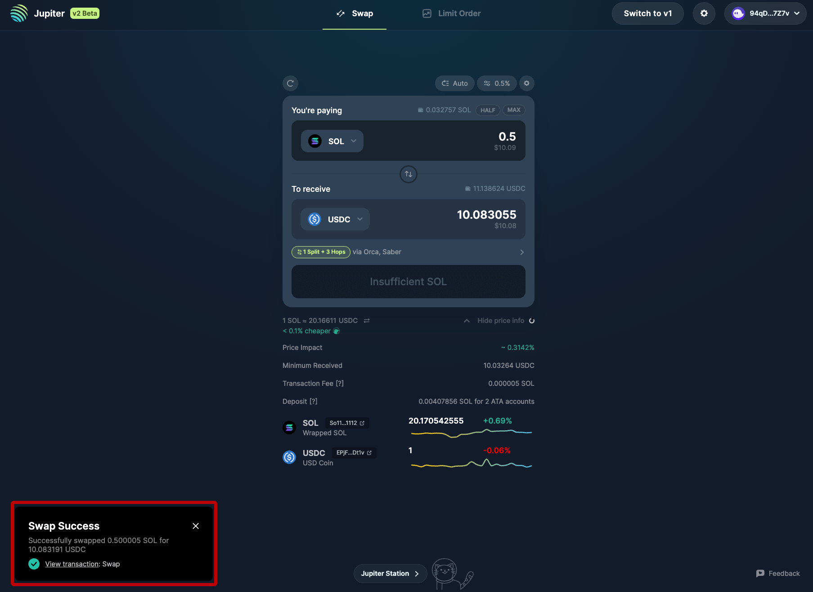
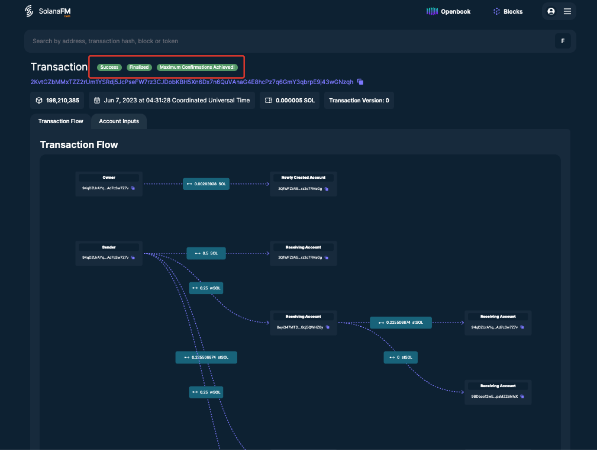
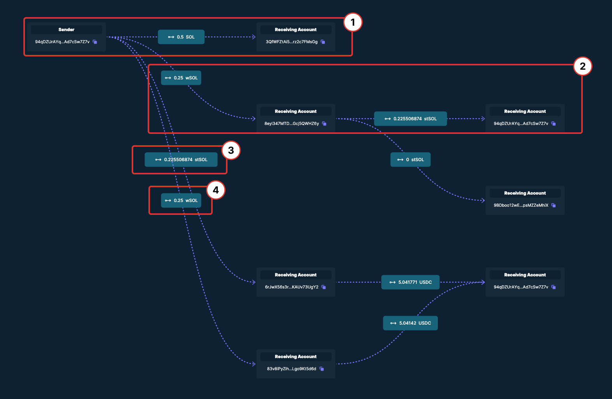

<head>
    <title>Verifying Swaps on Solana: A Step-by-Step Guide</title>
    <meta name="twitter:card" content="summary" />
</head>

:::tip This is a community contributed guide
This is a community guide to verifying Jupiter swaps on a Block Explorer, created by [@0xmiir](https://twitter.com/0xmiir), Marketing Lead at SolanaFM.

Anyone can contribute a guide to Jupiter Station! Simply send us a PR.
:::

When swapping tokens on Solana, you might come across occasional hiccups — sometimes transactions might not go through, a different amount of tokens appear in your wallet, or the token doesn’t appear at all. How do you figure out what’s going on?

This guide will walk you through how to verify your swaps on Jupiter.

:::tip Pro-tip: You can set your Default Explorer
To set a Default Explorer, click on the **'settings'** icon in the Jupiter app and set your 'Preferred Explorer'.
:::

## Viewing Your Swap Transaction

In this scenario, I’ve swapped **0.5SOL** for an estimated **10.08USDC** via **Saber** and **Orca**.

After completing the swap, the status of the swap appears on the bottom left of the interface — Let’s verify the details of the swap using the **SolanaFM Explorer**.

## Verifying your Swap

On SolanaFM, you can verify:

1. Transaction Failure/Success
2. Instructions Executed (The operations taking place within the transactions)
3. Movement of tokens (e.g. in and out of your wallet)

Let’s go through these in more detail.

## Transaction Failure/Success

At the top of the transaction interface, you can easily verify the status of the transaction.

A successful transaction shows “Success”, “Finalized” and “Maximum Confirmations Achieved”, while a failed transaction will show “Error”.

## Instructions Executed
Instructions within a transaction refer to the operations that have taken place for this transaction to happen successfully. 

Here, we can see that the **Jupiter Program** had interacted with the **Saber Stable Swap Program** and the **Orca Whirlpool Program** for the swap to take place.

Swap 1: 0.25 **SOL** → 0.225 **stSOL**

Swap 2: 0.225 **stSOL** → 5.04 **USDC**

Swap 3: 0.25 **SOL** → 5.04 **USDC**

## Movement of Tokens

The Transaction Flow helps us understand which tokens moved, and how much tokens moved in and out of your wallet accounts.

We’ve seen from the Instructions that 50% of the SOL amount was swapped into stSOL before being converted into USDC (via Saber), while the other 50% was converted directly into USDC (via Orca).

Movement 1: 0.5 SOL is converted and transferred into a wSOL token account

Movement 2: 0.25 SOL is converted into 0.2255 stSOL

Movement 3: 0.2255 stSOL is converted into 5.04 USDC and transferred into the original Sender account

Movement 4: 0.25 wSOL is converted into 5.04 USDC and transferred into the original Sender account

Once you confirm the transaction tallies with the details shown on the block explorer, you’re good to go. LFG!

