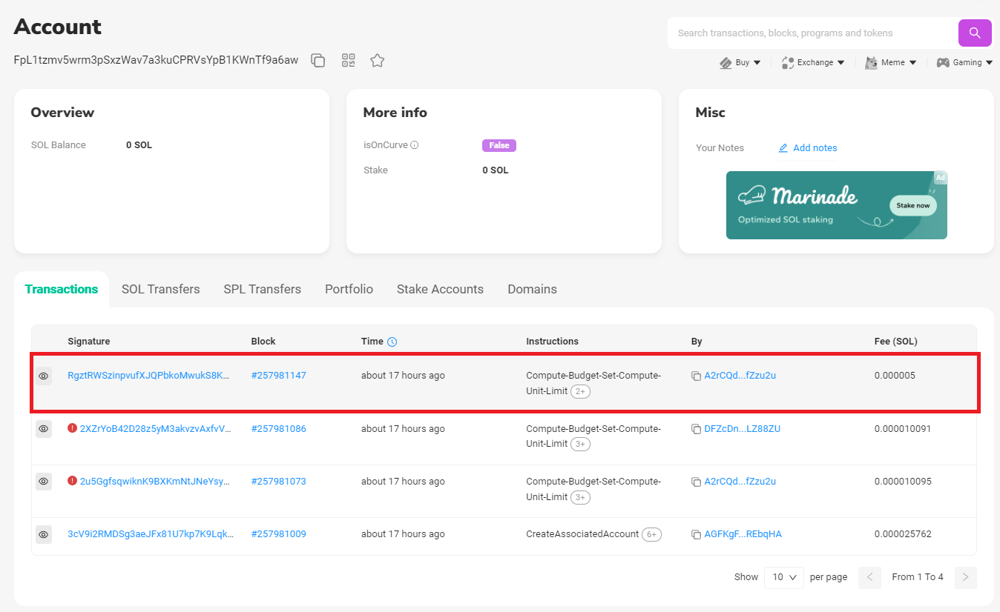

# FAQ - Frequently Asked Questions

### 1. I tried opening a position/adding collateral and it was not successful. Where are my funds?

Under normal circumstances, funds will be returned to your wallet in about 1-2 minutes. During periods of congestion on the Solana network there might be a delay for your funds to be returned to your wallet. If this is the case, you can close your expired request under the `Expired Orders` tab.

#### Follow these steps on how to find your funds.

1. Go to the Transaction ID


2. Scroll down to `CreateIncreasePositionMarketRequest`


3. Click on `Position Request` address


4. Click on the latest successful transaction



5. You could find your returned fund here:

For **SOL**, check **`SOL Balance Change`** tab


For **ALL other token**, check `Token Balance Change` tab


:::info
Wallet service providers might not be fully parsing the transactions, so, it is always a better idea to check on-chain. If you still couldn’t locate your fund although it was shown that it’s returned on the explorers, please contact your wallet service provider accordingly.
:::

### 2. I closed my position with profit and I have not received my funds.

You will receive the underlying asset for a LONG-position, i.e. SOL for SOL-Long, ETH for ETH-Long, wBTC for wBTC-Long.

You will receive either USDC or USDT for all SHORT-positions.

#### Perform these steps to check for funds from closed positions.

1. Under `Transaction History` on Jupiter Perpetual Trading, click on the transaction ID of the closed position.


2. You could find your returned fund here:

For **SOL-Long position**, check **`SOL Balance Change`** tab


For **ALL other positions**, check `Token Balance Change` tab


### 3. The price has reached my Take Profit/Stop Loss price on the chart. Why is my TP/SL not triggered?

- Missing Associated Token Accounts

  We won't be able to trigger a TP/SL if there is no active token account for the user. These are the associated token accounts (ATAs) needed for each position.

  - ETH Token Account for ETH-Long;
  - wBTC Token Account for wBTC-Long;
  - USDC and USDT Token Account for ALL Short positions.

- Oracle Price Not Reached

  There are two oracles that we are using for TP/SL, the Pyth Mainnet Oracles and the Pyth Pythnet oracles. For full detail, please refer [here](https://station.jup.ag/guides/perpetual-exchange/how-it-works#oracle).

  Our chart data is using the [Pythnet oracles](https://pyth.network/price-feeds/crypto-sol-usd?cluster=pythnet) and the positions uses the [Mainet oracles](https://pyth.network/price-feeds/crypto-sol-usd?cluster=solana-mainnet-beta).

If you are sure that you have an active ATA for the position and check the Mainnet oracle price and confirm that TP/SL is not triggered at the price it is supposed to, please open a [Perp-ticket](https://discord.com/channels/897540204506775583/1197460751556804608).

### 4. Why is my liquidation price changing?

There is an hourly borrow fee on every position, the hourly borrow fee will change the liquidation price over time.

If you want to understand how the hourly borrow rate works, you can check it out [here](https://station.jup.ag/guides/perpetual-exchange/how-it-works#hourly-borrow-rate).

### 5. I deposited 1 SOL (where 1 SOL = $100) for a 5x leveraged SOL-Long position and profited $50 (where 1 SOL = $110). Why did I get less than the full amount?

Assuming zero fees, with $50 profit, you will be getting SOL in return with value of $150.
At the time of closing the position, 1 SOL = $110,

```
$150 / $110 = 1.3636
```

You will be getting 1.3636 SOL where the value is equivalent to $150.


Here is another example, this is a SOL-Long position, the total amount the user should be getting is $3086.28 in SOL.

The value of SOL at the time is $189.28, hence `$3086.28 / $189.28 = 16.30`. The user will be receiving 16.30 SOL in return.

:::info
The **`PNL`** shown is the amount before fees. The exact amount is shown under **`Deposit/Withdraw`** tab.
:::

### 6. I have an existing SOL-Long position. I deposited 1 SOL to open a new SOL-Long position but I don’t see my new position.

Both positions will be combined into one position, where

- Leverage of the combined position = Average of the leverage level of each position.
  e.g. (1.2x + 1.4x) / 2 = 1.3x
- Size = initial collateral \* leverage level.

The TP/SL you have set earlier will remain the same after the positions are combined.
