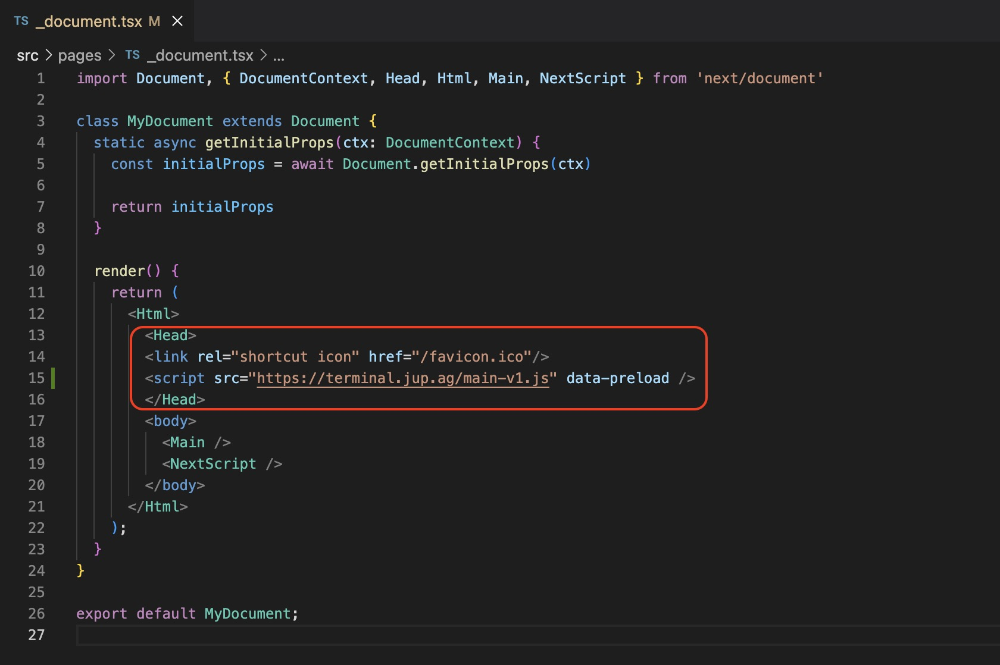
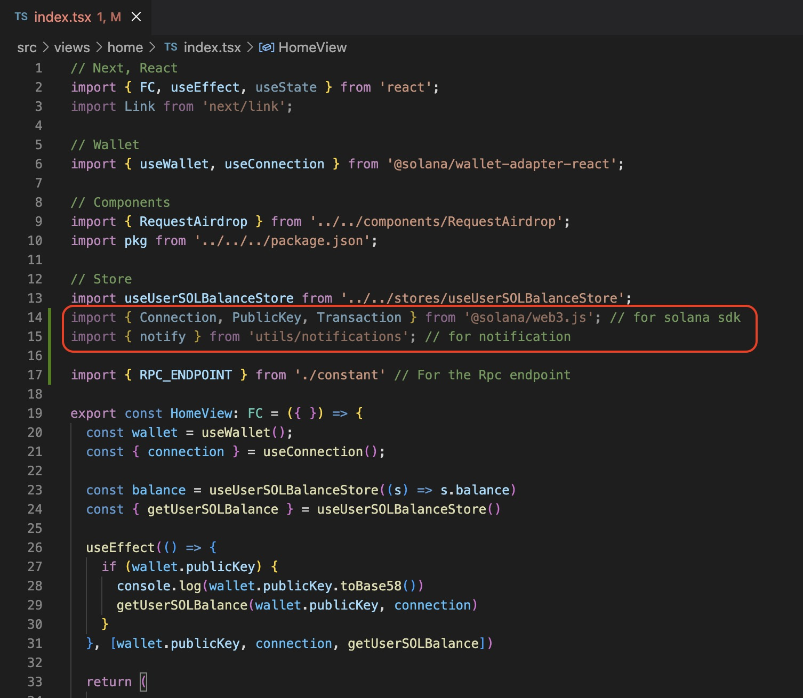

## Jupiter Terminal

Jupiter Terminal is an open-sourced, lite version of Jupiter that provides end-to-end swap flow by linking it in your HTML.

Visit our **Demo / Playground** over at https://terminal.jup.ag

With several templates to get you started, and auto generated code snippets.

**Github Repo**: https://github.com/jup-ag/terminal 

## Quick tutorial with Solana Dapp Scaffold


<iframe width="100%" height="315" src="https://www.youtube.com/embed/T-3KN3k1e5Y" title="YouTube video player" frameborder="0" allow="accelerometer; autoplay; clipboard-write; encrypted-media; gyroscope; picture-in-picture; web-share" allowfullscreen></iframe>

[Watch tutorial on YouTube](https://youtu.be/T-3KN3k1e5Y)

:::info 
A quick example with Solana Dapp scaffold as the base and integrate Jupiter Terminal on top of it.
:::

Solana Labs Dapp scaffold Repo: https://github.com/solana-labs/dapp-scaffold

1. Clone Solana Dapp Scaffold repo into your local machine or working environment.
2. Update dependencies, in this example it will be `pnpm install`
3. Fire up the development environment in your localhost, in this example it will be `pnpm dev`


4. Next, change your network configuration from `devnet` to `mainnet-beta` in `NetworkConfigurationProvider.tsx` file. 


5. Include Jupiter Terminal script into your `src/pages/_document.tsx` file.

``` js
<script src="https://terminal.jup.ag/main-v1.js" data-preload />
```


6. Next, include some of the basic script into `src/views/home/index.tsx` file. 

``` js
import { Connection, PublicKey, Transaction } from '@solana/web3.js';
import { notify } from 'utils/notifications';
```

More info on [`@solana/web3.js`](https://solana-labs.github.io/solana-web3.js/)



7. Next, you will need a working RPC endpoint for the transaction to work properly. In this example, we park our RPC_ENDPOINT in `src/views/home/constant.ts` and import or initialize with `import { RPC_ENDPOINT } from './constant'`.


:::info 
It is recommended that you use your own RPC endpoint.
This RPC_ENDPOINT is only for demonstration purposes so that this example will run.
:::

8. Here comes the *fun part*, this is where you can customize the setting and configuration that best fit your dApp or site in [`Jupiter Terminal Playground`](https://terminal.jup.ag/)


9. Lastly, there's a Code snippet in the Terminal playground with your configuration. Copy the code snippet and plug it directly into your file, in this example it will be `src/views/home/index.tsx` file. 


In this example, we're using `Modal Mode` hence we're adding a button (Launch Jupiter Terminal) to trigger Jupiter Terminal in the scaffold dapp.


:::success You're all up and ready to roll!
Do reach out if you're integrating Jupiter Terminal to your project, we're happy to support.
:::