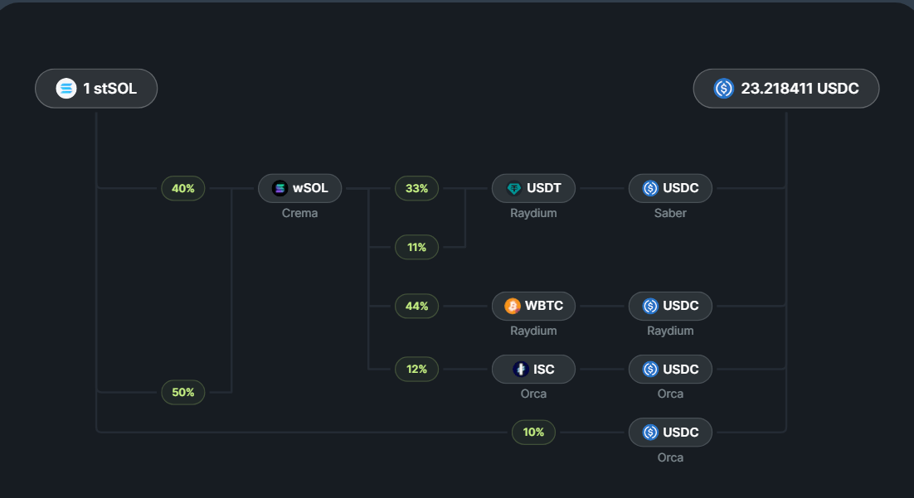

<head>
    <title>Jupiter Swap | Quickstart</title>
    <meta name="twitter:card" content="summary" />
</head>

## Overview

Jupiter Swap is an intricate solution that has evolved over time. It began its journey by solving the expansive number of AMMs (Automated Market Makers) in Solana DeFi (Decentralized Finance). This helped users to find the best price across multiple AMMs with the least friction.

However, as Solana grew more popular especially with the inception of Pump.fun and the various memecoin explosions, there were many markets and tokens to be indexed. In 2024, we have improved our infrastructure to support many more markets easily while still safeguarding our users.

A high level overview of how swap works:

1. Token created, market created on any AMMs (we support most!).
2. Our indexer picks it up immediately, and regardless of liquidity requirements, they are tradable.
3. After 14 days, the market will be checked for the first time and subsequently checked every 30 minutes for its [liquidity requirements](../general/get-your-token-on-jupiter#how-to-get-your-pool-routed-on-jupiter).
    - The market will either be dropped or continue to be served
4. Our routing engine will perform math and algorithms to ensure you achieve the best quote at time of quote.
5. During swap execution, there are [settings and safeguards](../1-swap/2-tutorials/3-how-to-trade-safely.md) to help you achieve a better user experience.

## Metis: Our Routing Engine

Metis is one of the big parts of how Jupiter Swap works, it is a heavily modified variant of the [Bellman-Ford algorithm](https://en.wikipedia.org/wiki/Bellman%E2%80%93Ford_algorithm) catered for the key requirements of offering best price routing at scale in a very dynamic operational space.

Metis is designed to operate seamlessly on Solana’s hyper-fast blocktimes, supported by major improvements to our backend infrastructure. This ensures that trades are executed quickly and efficiently, even under high demand.

Metis enhances our industry-leading aggregator by improving route discovery for all trading pairs, reducing slippage for large trades, and offering scalable solutions in preparation for upcoming Solana upgrades and new DEXs.

### Incremental Route Building

To find the best price, Metis streams the input tokens to incrementally build a route to split and merge at any stage. By generating the routes for each split iteratively one after another, we can also use the same DEX in different splits - allowing us to find routes with better prices with more complex trades.

### Combine Route Generation and Quoting

To improve the efficiency of the algo, we combine route generation and quoting into a single step, allowing us to avoid generating and using bad routes, which besides improving the efficiency, also allows us to use a larger set of tokens as intermediaries.

### Future Proofing

v2 runs fast when the total number of DEXs used is small since Solana limits us to use at most 4 DEXs in a swap *(due to the account lock limit of 64)*. Future Solana upgrades will relax this limit and allow more DEXs to be used in a single transaction. In addition, we foresee the continued growth of the Solana DeFi ecosystem, which means there will be many more DEXs emerging.

Metis(v3) is equipped to handle both of these trends, since the algorithm is able to scale to include more DEXs in a route when account lock limits are increased, and can support more DEXs with only a modest increase in running time.

### Performance Improvements

Metis is able to refresh quotes in parallel and in real time. Compared to v2, metis on average quotes prices that are 5.22% better. These improvements increase sharply based on the trade size.

*Last Updated: 4 November 2024*
