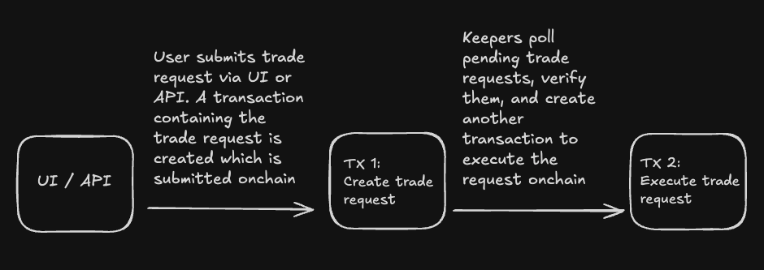

# Request Fulfillment model & Off-Chain Keepers

## Request fulfilment model

The Jupiter Perpetuals exchange uses an onchain request fulfilment model to create and execute trade requests.

### Create trade request

A trader can perform the following actions on the Jupiter Perpetuals exchange:

* Open position
* Close position
* Increase position size
* Decrease position size / close partial position
* Deposit collateral
* Withdraw collateral
* Create take profit (TP) / stop loss (SL) order
* Edit TP / SL order
* Close TP / SL order

The trader performs the actions above through the Jupiter Perpetuals platform or via the API. The frontend or API server then verifies the action and submits a transaction on the Solana blockchain containing the trader's request.

For example, if the trader created an open position request, the transaction would contain data such as the trade size, collateral size, position side, and other data required to fulfil the request and ultimately open the position.

### Fulfil trade request

Jupiter hosts two keepers that continuously poll the Solana blockchain for trade requests.&#x20;

Once a trade request is fetched by a keeper, it verifies the trade request before creating and submitting another transaction to execute the trade.

The trade is executed when the transaction succeeds and is confirmed by the Solana blockchain, thus updating the position or TP / SL request.

This means there are two transactions required to complete a trade request: one for the trade request and another one to fulfil the trade request.

:::info
Keepers are offchain services that listen to onchain events and perform actions corresponding to the event. They enable automatic and timely execution of trade requests without manual intervention.

Jupiter Perpetuals' keepers listen to the trade requests listed above and execute them by verifying the requests and submitting transactions that contain the actual program instructions for the trade request.
:::

## Frequently Asked Questions

### Is the keeper code open-source?

The keeper code is not open-source. However, our keepers are audited and are tested extensively before they're deployed.

### I submitted a trade request but my trade was not executed

Keepers may fail to execute requests due to a variety of reasons (network congestion, keeper downtime, etc.)

A trade request that has not been executed after 45 seconds is considered stale and will be rejected. Tokens deposited by the trader for the trade request will be returned to the trader. Tokens will be returned to the position for collateral withdrawals or close position requests.

:::info
Please open a support ticket on the [Jupiter Discord support channel](https://discord.gg/jup) if your trade request was not executed or if you face any issues creating trade requests.
:::

### Can I host my own keeper?

We do not allow community members to run their own keepers at the moment. As mentioned above, our keepers are audited and tested extensively so they're able to execute trade requests reliably.

### Where do I see the keeper accounts?

We currently run two keepers:
1. [https://solscan.io/account/A2rCQdCqQB4wu72x9Q7iq1QugtdZmcyWsiSPfgfZzu2u](https://solscan.io/account/A2rCQdCqQB4wu72x9Q7iq1QugtdZmcyWsiSPfgfZzu2u)
2. [https://solscan.io/account/DFZcDnmEYNUK1khquZzx5dQYiEyjJ3N5STqaDVLZ88ZU](https://solscan.io/account/DFZcDnmEYNUK1khquZzx5dQYiEyjJ3N5STqaDVLZ88ZU)
