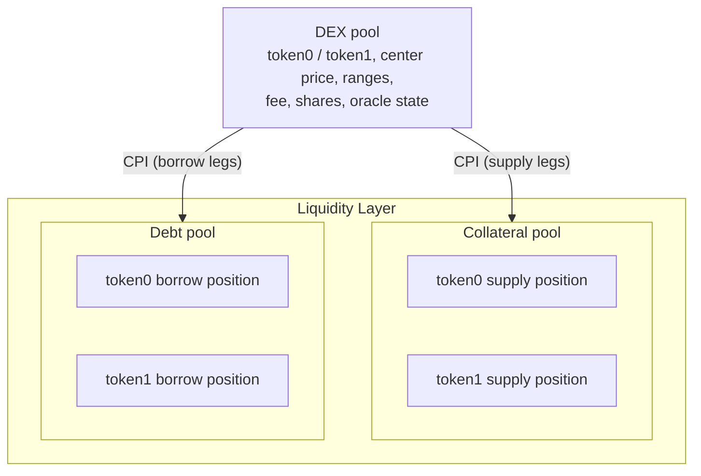

The Jupiter Lend DEX is a concentrated-liquidity AMM that runs on top of the Jupiter Lend Liquidity Layer. This guide is for routers, aggregators, and on-chain programs that want to swap against the DEX directly.

The guide is self-contained: the on-chain behaviour relevant to swaps is described here, and the SDKs mirror it. You do not need access to the program source. It covers the two paths integrators build on:

- **[TypeScript](/lend/dex/typescript)**: request a quote, then execute the swap from a wallet or backend using the published SDKs.
- **[Rust / CPI](/lend/dex/cpi)**: call `swap_in` / `swap_out` from your own on-chain program via cross-program invocation.
- **[Errors](/lend/dex/errors)**: the swap-path error codes, what triggers them, and how to avoid them.

<Note>
**Scope: swaps only.** Liquidity actions (deposit, withdraw, borrow, payback) and admin instructions are out of scope for this guide.
</Note>

## How the DEX works

A Jupiter Lend DEX **pool** trades exactly one pair of tokens, `token0` and `token1`. It is a concentrated-liquidity AMM: liquidity is packed into a price range around a center price, so trades near the current price get much deeper liquidity than a constant-product pool of the same size.

The tokens backing a pool are **Liquidity Layer** positions, not tokens the pool custodies. A pool can therefore exist in three shapes:

| Pool shape            | Smart collateral | Smart debt | Behaviour                                          |
| --------------------- | :--------------: | :--------: | -------------------------------------------------- |
| **Collateral pool**   |        on        |    off     | swaps trade against LP supply                       |
| **Debt pool**         |       off        |     on     | swaps trade against borrow debt                     |
| **Collateral + debt** |        on        |     on     | swaps route across both sides, kept in price-sync   |

For swapping you don't need to care which shape a pool is. The program routes across whatever sides are enabled and returns a single input/output amount. The SDK quote does the same math off-chain.

## The two swap instructions

| Instruction | Form      | You specify                               | Returns                |
| ----------- | --------- | ----------------------------------------- | ---------------------- |
| `swap_in`   | exact-in  | `swap0to1`, `amount_in`, `amount_out_min` | `amount_out` received  |
| `swap_out`  | exact-out | `swap0to1`, `amount_out`, `amount_in_max` | `amount_in` it cost    |

- **`swap0to1`** picks direction: `true` trades `token0 → token1`, `false` trades `token1 → token0`.
- **`amount_out_min` / `amount_in_max`** are your slippage guards, enforced on-chain. `swap_in` reverts if the output is below `amount_out_min`; `swap_out` reverts if the input exceeds `amount_in_max`. No funds move on a revert.
- Both instructions **return** the computed counter-amount as a `u64` (Anchor return data), so a CPI caller reads the result directly.

## Conventions that affect integrators

- **`token0` / `token1` are ordered by public key.** `token0` is the mint whose address sorts lower. This is fixed per pool; compute `swap0to1` from the mints you hold, not from a fixed slot.
- **All amounts are native token units** (base units of that mint's decimals) at the API edge. Internally the pool works in a common 9-decimal representation and scales back to native decimals at the boundary. Token decimals above 9 are not supported.
- **Rounding always favours the pool.** Exact-in floors the output; exact-out ceils the input. Quote, then guard with slippage.
- **Pools are addressed by a small integer `dex_id`** (`1..=totalDexes`).

## Program addresses

| Program         | Address                                       |
| --------------- | --------------------------------------------- |
| DEX             | `jupZ4m2GqUCJ5iueMfzQf8khFfH31d4XAQt3RzCT9Vd` |
| Liquidity Layer | `jupeiUmn818Jg1ekPURTpr4mFo29p46vygyykFJ3wZC` |
| Oracle          | `jupnw4B6Eqs7ft6rxpzYLJZYSnrpRgPcr589n5Kv4oc` |

## PDAs

DEX PDAs are derived against the **DEX** program id; the Liquidity Layer accounts a swap touches are derived against the **Liquidity Layer** program id. Seeds (all strings are ASCII bytes; `dex_id` is a little-endian `u16`):

| Account              | Program   | Seeds                                 |
| -------------------- | --------- | ------------------------------------- |
| `Dex` (pool)         | DEX       | `["dex", dex_id]`                     |
| `DexMetadata`        | DEX       | `["dex_metadata", dex_id]`            |
| Reserve              | Liquidity | `["reserve", mint]`                   |
| Rate model           | Liquidity | `["rate_model", mint]`                |
| User supply position | Liquidity | `["user_supply_position", mint, dex]` |
| User borrow position | Liquidity | `["user_borrow_position", mint, dex]` |
| Liquidity (root)     | Liquidity | `["liquidity"]`                       |

Token **vaults** are the associated token account of the Liquidity root PDA for each mint (allow-owner-off-curve). The **`DexMetadata`** account stores the pool's **address lookup table** (`lookup_table`), which you use to keep swap transactions under the size limit. The SDK derives all of these for you.

## How a pool sits on the Liquidity Layer

A DEX pool holds no token balances of its own. It is registered as a protocol on the Liquidity Layer, and the tokens that back it are Liquidity Layer positions:

- The **collateral pool** is a pair of Liquidity Layer **supply** positions (one for `token0`, one for `token1`). Liquidity providers deposit, and the supplied tokens earn the lending supply rate while also serving swaps.
- The **debt pool** is a pair of Liquidity Layer **borrow** positions. Borrowers draw debt against the pool, and that outstanding debt is itself the liquidity a swap trades against.

Every swap drives this CPI flow: the DEX computes amounts, then calls the Liquidity Layer to move the actual tokens and update the positions. Because the reserves are Liquidity Layer positions, they carry exchange prices (interest accrual): the DEX converts raw position amounts into current-value amounts before doing any AMM math, so a pool reflects accrued interest automatically.

Details that matter when you integrate:

- **Pool state** lives in one `Dex` account per pair (seeds `["dex", dex_id]`), holding the pair identity, live pricing (`center_price` and the oracle's last stored prices), mode switches, range configuration, fees, and share accounting. The optional `center_price_address` field points at an external price source; an all-zero value means the pool prices internally. This distinction matters for the accounts a swap must pass, see [external center price](/lend/dex/cpi#external-center-price-and-remaining-accounts).
- **Liquidity provider stakes are shares, not token balances.** Supply shares are a proportional claim on the collateral pool's two reserves; borrow shares are a proportional obligation against the debt pool's two reserves. Swappers never touch shares.
- **Re-entrancy lock.** Every user-facing entry point takes a per-pool `re_entrancy` lock and releases it at the end. A second entry while locked reverts with `DexAlreadyEntered` (6017), so you cannot swap the same pool twice inside one instruction.
- **Pausing.** Admins can pause a whole pool (`pause_dex`) or only swaps and the rebalance step (`pause_swap_and_arbitrage`). Paused swaps revert with `DexSwapAndArbitragePaused` (6050).
- **Automatic arbitrage.** Every operation on a two-sided pool ends with an automatic arbitrage step that re-syncs the collateral and debt prices. It runs inside the swap instruction; you don't invoke it.

## Integration paths

Both paths are the same three steps: **quote → guard → execute**. The only difference is where the code runs.

<CardGroup cols={2}>
  <Card icon="code" href="/lend/dex/typescript" title="TypeScript">
    Quote with `@jup-ag/lend-read`, build and send the swap with `@jup-ag/lend/dex`. For off-chain integrations.
  </Card>
  <Card icon="link" href="/lend/dex/cpi" title="Rust / CPI">
    Call `swap_in` / `swap_out` from your own program via CPI, with the full 25-account context and a raw instruction recipe.
  </Card>
</CardGroup>
