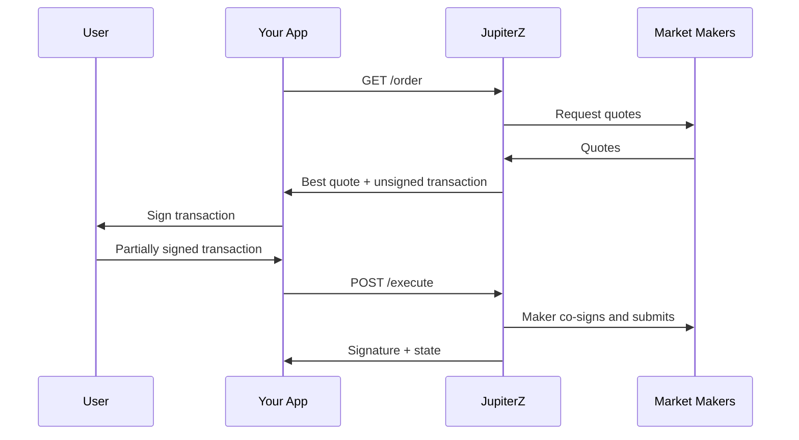

The JupiterZ API lets you source RFQ liquidity directly: request a firm quote from Jupiter's market makers, have the user sign the returned transaction, and send it back for execution. The market maker co-signs and submits the transaction on-chain, so you never build or land the transaction yourself.

This page is for integrators consuming quotes: wallets, aggregators, trading UIs and bots. On the [Meta-Aggregator path](/swap/order-and-execute), JupiterZ competes with the other routers for the best price; the JupiterZ API skips the competition and quotes RFQ market makers only. If you are a market maker looking to provide liquidity, see [Integrate MM into JupiterZ](/swap/routing/rfq-integration).

## Base URL and authentication

```
https://api.jup.ag/swap/v2/jupiterz
```

Every request must carry an API key from the [Developer Platform](https://developers.jup.ag/portal) in the `x-api-key` header. Requests without it return `401 Unauthorized`.

| Endpoint | Method | Purpose |
| :--- | :--- | :--- |
| [`/order`](/api-reference/swap/jupiterz/order) | `GET` | Best quote for a single token pair |
| [`/global-order`](/api-reference/swap/jupiterz/global-order) | `GET` | Best quote across multiple candidate output mints |
| [`/execute`](/api-reference/swap/jupiterz/execute) | `POST` | Submit the signed transaction for execution |

## How it works



The `transaction` returned by `/order` is a base64-encoded versioned transaction. The taker signs it (a partial signature), then the market maker adds the final signature and submits it on-chain.

Market makers quote a firm price: `orderInfo` amounts have equal `startAmount` and `endAmount`, so there is no slippage range and no slippage parameter.

## Quick start

Three steps: get an order, sign it, execute it.

### Prerequisites

<Accordion title="Imports and setup">

```typescript
// @solana/kit
import {
  createKeyPairSignerFromBytes,
  getBase58Encoder,
  getTransactionDecoder,
  getTransactionEncoder,
  partiallySignTransaction,
} from "@solana/kit";

// @solana/web3.js
import { VersionedTransaction, Keypair } from "@solana/web3.js";
import bs58 from "bs58";

const BASE_URL = "https://api.jup.ag/swap/v2/jupiterz";
const API_KEY = process.env.JUPITER_API_KEY!;

// Load a signer from a base58 secret key in .env
// kit:
const signer = await createKeyPairSignerFromBytes(
  getBase58Encoder().encode(process.env.BS58_PRIVATE_KEY!),
);
// web3.js:
// const signer = Keypair.fromSecretKey(bs58.decode(process.env.BS58_PRIVATE_KEY!));
```

</Accordion>

### Code example

<CodeGroup>
```typescript expandable title="@solana/kit"
// Step 1: Get an order
const orderResponse = await fetch(
  `${BASE_URL}/order?` +
    new URLSearchParams({
      inputMint: "So11111111111111111111111111111111111111112", // SOL
      outputMint: "EPjFWdd5AufqSSqeM2qN1xzybapC8G4wEGGkZwyTDt1v", // USDC
      amount: "100000000",
      taker: signer.address,
      swapMode: "ExactIn",
    }),
  { headers: { "x-api-key": API_KEY } },
);
if (!orderResponse.ok) {
  console.error(`/order failed: ${orderResponse.status}`, await orderResponse.text());
  process.exit(1);
}
const order = await orderResponse.json();

if (!order.transaction) {
  // Indicative quote: no taker, insufficient balance, or missing token account
  console.error("No transaction in response:", JSON.stringify(order, null, 2));
  process.exit(1);
}

// Step 2: Sign the transaction
// Use partiallySignTransaction because the market maker adds the
// final signature during /execute
const transactionBytes = Buffer.from(order.transaction, "base64");
const transaction = getTransactionDecoder().decode(transactionBytes);
const signedTransaction = await partiallySignTransaction(
  [signer.keyPair],
  transaction,
);

// Step 3: Execute, re-checking while the fill is pending
const signedTxBytes = getTransactionEncoder().encode(signedTransaction);
const executeBody = {
  requestId: order.requestId,
  quoteId: order.quoteId,
  transaction: Buffer.from(signedTxBytes).toString("base64"),
};

let result;
for (let attempt = 0; attempt < 10; attempt++) {
  const executeResponse = await fetch(`${BASE_URL}/execute`, {
    method: "POST",
    headers: { "Content-Type": "application/json", "x-api-key": API_KEY },
    body: JSON.stringify(executeBody),
  });
  if (!executeResponse.ok) {
    console.error(`/execute failed: ${executeResponse.status}`, await executeResponse.text());
    process.exit(1);
  }
  result = await executeResponse.json();
  // "accepted" means submitted but not yet confirmed; re-calling with the
  // same requestId re-checks the swap, it does not re-execute it
  if (result.state !== "accepted") break;
  await new Promise((r) => setTimeout(r, 1000));
}

if (result.state === "confirmed") {
  console.log("Swap confirmed:", `https://solscan.io/tx/${result.signature}`);
} else {
  console.error("Swap not confirmed:", JSON.stringify(result, null, 2));
}
```

```typescript expandable title="@solana/web3.js"
// Step 1: Get an order
const orderResponse = await fetch(
  `${BASE_URL}/order?` +
    new URLSearchParams({
      inputMint: "So11111111111111111111111111111111111111112", // SOL
      outputMint: "EPjFWdd5AufqSSqeM2qN1xzybapC8G4wEGGkZwyTDt1v", // USDC
      amount: "100000000",
      taker: signer.publicKey.toString(),
      swapMode: "ExactIn",
    }),
  { headers: { "x-api-key": API_KEY } },
);
if (!orderResponse.ok) {
  console.error(`/order failed: ${orderResponse.status}`, await orderResponse.text());
  process.exit(1);
}
const order = await orderResponse.json();

if (!order.transaction) {
  // Indicative quote: no taker, insufficient balance, or missing token account
  console.error("No transaction in response:", JSON.stringify(order, null, 2));
  process.exit(1);
}

// Step 2: Sign the transaction
// The taker signature is a partial signature; the market maker adds the
// final signature during /execute
const transaction = VersionedTransaction.deserialize(
  Buffer.from(order.transaction, "base64"),
);
transaction.sign([signer]);

// Step 3: Execute, re-checking while the fill is pending
const executeBody = {
  requestId: order.requestId,
  quoteId: order.quoteId,
  transaction: Buffer.from(transaction.serialize()).toString("base64"),
};

let result;
for (let attempt = 0; attempt < 10; attempt++) {
  const executeResponse = await fetch(`${BASE_URL}/execute`, {
    method: "POST",
    headers: { "Content-Type": "application/json", "x-api-key": API_KEY },
    body: JSON.stringify(executeBody),
  });
  if (!executeResponse.ok) {
    console.error(`/execute failed: ${executeResponse.status}`, await executeResponse.text());
    process.exit(1);
  }
  result = await executeResponse.json();
  // "accepted" means submitted but not yet confirmed; re-calling with the
  // same requestId re-checks the swap, it does not re-execute it
  if (result.state !== "accepted") break;
  await new Promise((r) => setTimeout(r, 1000));
}

if (result.state === "confirmed") {
  console.log("Swap confirmed:", `https://solscan.io/tx/${result.signature}`);
} else {
  console.error("Swap not confirmed:", JSON.stringify(result, null, 2));
}
```
</CodeGroup>

<Note>
Sign the transaction as-is. Rebuilding it, reordering instructions or changing amounts invalidates it: the market maker verifies the transaction it originally quoted before co-signing.
</Note>

## Getting an order

`GET https://api.jup.ag/swap/v2/jupiterz/order` asks every eligible market maker for a price and returns the best one. See the [API reference](/api-reference/swap/jupiterz/order) for all parameters, including integrator fees (`integratorFee`, `integratorTokenAccount`, `integratorFeeSide`) and Squads vault swaps (`settingsPda`, `signers`).

All amounts are strings in the token's smallest unit, so no precision is lost: `"1000000"` is 1 USDC (6 decimals), `"1000000000"` is 1 SOL (9 decimals).

### Quote expiry

`expireAt` is a Unix timestamp (seconds) after which the transaction is no longer valid. Sign and execute before it passes. Executing an expired quote returns `400` with `errorCode: "QUOTE_EXPIRED"`; request a fresh order instead.

### Indicative quotes

Two cases return a price but no `transaction`, so you can display pricing before the user is ready to trade:

- **No `taker`**: there is nothing to build a transaction against. `error` is omitted.
- **`taker` provided, but the transaction cannot be built**: `error` explains why.

| `error` | Meaning |
| :--- | :--- |
| `insufficientBalance` | The taker does not hold enough of the input token |
| `missingAtaAccount` | A token account required by the swap does not exist on-chain |

Always check that `transaction` is non-null before signing.

### No quote available

When no market maker quotes the pair, `/order` returns `404` with `errorCode: "NO_QUOTE_FOUND"`. Fall back to another liquidity source, such as the [Meta-Aggregator](/swap/order-and-execute).

## Global order

`GET https://api.jup.ag/swap/v2/jupiterz/global-order` quotes one input mint against several candidate output mints and returns only the leg worth the most in USD. Useful when you do not care which stablecoin (or wrapper) the user ends up with, just which one pays best.

Parameters are identical to `/order`, with two differences:

- `outputMint` takes a comma-separated list of mints (currently up to 3).
- `ExactIn` only.

```bash
curl -G 'https://api.jup.ag/swap/v2/jupiterz/global-order' \
  -H 'x-api-key: your-api-key' \
  -d inputMint=So11111111111111111111111111111111111111112 \
  -d outputMint=EPjFWdd5AufqSSqeM2qN1xzybapC8G4wEGGkZwyTDt1v,Es9vMFrzaCERmJfrF4H2FYD4KCoNkY11McCe8BenwNYB \
  -d amount=1000000000 \
  -d taker=5v2Vd71VoJ1wZhz1PkhTY48mrJwS6wF4LfvDbYPnJ3bc
```

The response has the same shape as `/order`. `orderInfo.output.token` tells you which mint won, and `requestId` identifies that winning leg. Pass the `requestId` and `quoteId` to `/execute` unchanged.

The candidate list is capped server-side. Passing zero mints or more than the cap returns `400` with the allowed range in the error message.

## Executing

`POST https://api.jup.ag/swap/v2/jupiterz/execute` takes the taker-signed transaction and hands it to the market maker, who adds the final signature and submits it to Solana. The body is `requestId`, `quoteId` and the signed `transaction`, all from the order response.

### States

| State | `signature` | Meaning |
| :--- | :--- | :--- |
| `confirmed` | Present | The swap landed on-chain. Terminal |
| `accepted` | `null` | The market maker accepted and submitted the swap, on-chain confirmation is pending |
| `rejected` | `null` | The market maker declined to fill |
| `invalid` | `null` | The transaction did not pass validation |
| `failed` | `null` | Network error or timeout reaching the market maker |

A rejected or failed swap still returns `200 OK` with the state in the body. Check `state`, not just the HTTP status.

### Pending confirmations

An `accepted` response means the transaction was submitted but not yet seen as confirmed. Calling `/execute` again with the same `requestId` is safe: it does not re-execute the swap, it re-checks the existing one and returns `confirmed` with the signature once it lands. The quick start code above shows the re-check loop.

## Errors

Errors use a consistent JSON body:

```json
{
  "error": "No quote found",
  "errorCode": "NO_QUOTE_FOUND"
}
```

`error` is always present. `errorCode` is `null` unless the failure maps to one of the codes below.

| Status | Meaning |
| :--- | :--- |
| `400 Bad Request` | Invalid or missing parameters, expired quote, failed simulation |
| `401 Unauthorized` | Missing or invalid `x-api-key` |
| `404 Not Found` | No market maker quoted this pair |
| `429 Too Many Requests` | Rate limit exceeded |
| `500 Internal Server Error` | Server-side failure |

| Code | Meaning |
| :--- | :--- |
| `NO_QUOTE_FOUND` | No market maker returned a quote for this request |
| `QUOTE_EXPIRED` | The quote expired before `/execute` was called |
| `0x1` | Taker has insufficient funds |
| `0xbc4` | A required token account is missing |
| `0x11` | A token account involved in the swap is frozen |
| `SIMULATION_FAILED` | The swap could not be simulated |
| `TRANSACTION_ERROR` | Transaction-level failure during simulation |
| `INSTRUCTION_ERROR` | Instruction-level failure during simulation |

## Related

- [Get Order API reference](/api-reference/swap/jupiterz/order)
- [Get Global Order API reference](/api-reference/swap/jupiterz/global-order)
- [Execute Order API reference](/api-reference/swap/jupiterz/execute)
- [Order & Execute](/swap/order-and-execute): all routers compete, Jupiter handles landing
- [Integrate MM into JupiterZ](/swap/routing/rfq-integration): provide liquidity as a market maker
