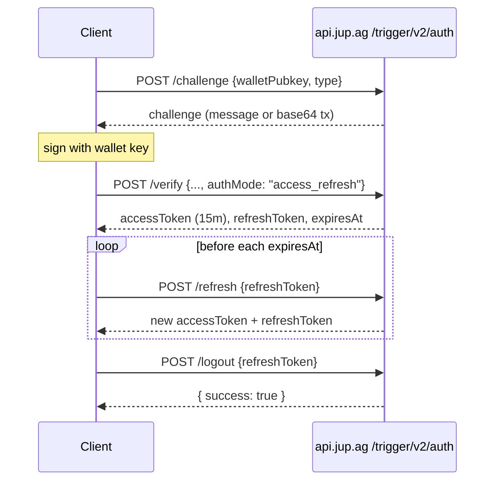

The Trigger Order API V2 uses a challenge-response flow to authenticate users. Your wallet signs a challenge, and the server issues a JWT. There are two auth modes:

- **`access_refresh`** (recommended): a 15-minute access token plus a rotating refresh token. Extend the session by calling `/refresh`, and revoke it with `/logout` or `/logout-all`.
- **`access_only`** (deprecated): a single JWT valid for 24 hours with no refresh or revocation. This is still the default when `authMode` is omitted.

<Warning>
**`access_only` is deprecated (2026-07-21) and will be removed.** If your client omits `authMode`, the server still responds as `access_only` and sets a `Deprecation` response header. Nothing breaks today, but `authMode: "access_only"` will stop being accepted at removal. Send `authMode: "access_refresh"` on `/verify` to migrate. See [Migrate from access_only](#migrate-from-access-only).
</Warning>

## Auth modes at a glance

| Topic | `access_only` (deprecated) | `access_refresh` (recommended) |
| :--- | :--- | :--- |
| Access token lifetime | 24 hours | 15 minutes |
| Verify response token field | `token` | `accessToken` |
| Extend a session | Re-authenticate (new challenge) | `POST /trigger/v2/auth/refresh` |
| Revoke a session | Not possible before expiry | `/logout` (one session), `/logout-all` (all sessions), reuse detection |
| Response headers | `Deprecation`, `Link` | none |

## Prerequisites

Signing challenges and transactions requires `@solana/web3.js` and `bs58`:

```bash
npm install @solana/web3.js bs58
```

## Step 1: Request a challenge

Request a challenge for your wallet. The `type` field selects how your wallet will sign, and accepts exactly two values:

| `type` | Use it for | You sign with |
| :--- | :--- | :--- |
| `message` | Standard wallets (Phantom, Solflare, and most others) | `signMessage` on the returned `challenge` string |
| `transaction` | Hardware wallets (Ledger, etc.) that only support transaction signing | `signTransaction` on the returned `transaction` (it is never submitted on-chain) |

Both prove wallet ownership and return the same tokens. Any other value returns a `400`. Challenges expire after 5 minutes; request a new one if yours expires.

```typescript
const challengeResponse = await fetch('https://api.jup.ag/trigger/v2/auth/challenge', {
  method: 'POST',
  headers: {
    'Content-Type': 'application/json',
    'x-api-key': 'your-api-key',
  },
  body: JSON.stringify({
    walletPubkey: walletAddress,
    type: 'message',  // or 'transaction' for hardware wallets
  }),
});

const challenge = await challengeResponse.json();
```

**Message challenge response:**
```json
{
  "type": "message",
  "challenge": "Sign this message to authenticate with Jupiter Trigger Order API..."
}
```

**Transaction challenge response:**
```json
{
  "type": "transaction",
  "transaction": "Base64EncodedTransactionWithMemoInstruction..."
}
```

## Step 2: Verify and get tokens

Sign the challenge with your wallet, then submit the signature to `/verify`. Add `authMode: "access_refresh"` to the request body to receive refresh tokens. The challenge step is identical for both auth modes.

**For message signing:**
```typescript
import bs58 from 'bs58';

// Sign the challenge message with your wallet
const encodedMessage = new TextEncoder().encode(challenge.challenge);
const signature = await wallet.signMessage(encodedMessage);

const verifyResponse = await fetch('https://api.jup.ag/trigger/v2/auth/verify', {
  method: 'POST',
  headers: {
    'Content-Type': 'application/json',
    'x-api-key': 'your-api-key',
  },
  body: JSON.stringify({
    type: 'message',
    walletPubkey: walletAddress,
    signature: bs58.encode(signature),
    authMode: 'access_refresh',
  }),
});

const { accessToken, refreshToken, expiresAt } = await verifyResponse.json();
// Store all three. Use accessToken in Authorization: Bearer <accessToken>.
```

**For transaction signing (hardware wallets):**
```typescript
import { VersionedTransaction } from '@solana/web3.js';

const signedTx = await wallet.signTransaction(
  VersionedTransaction.deserialize(Buffer.from(challenge.transaction, 'base64'))
);

const verifyResponse = await fetch('https://api.jup.ag/trigger/v2/auth/verify', {
  method: 'POST',
  headers: {
    'Content-Type': 'application/json',
    'x-api-key': 'your-api-key',
  },
  body: JSON.stringify({
    type: 'transaction',
    walletPubkey: walletAddress,
    signedTransaction: Buffer.from(signedTx.serialize()).toString('base64'),
    authMode: 'access_refresh',
  }),
});

const { accessToken, refreshToken, expiresAt } = await verifyResponse.json();
```

**`access_refresh` response:**
```json
{
  "authMode": "access_refresh",
  "accessToken": "<jwt, expires in 15 minutes>",
  "refreshToken": "<opaque>",
  "expiresAt": "2026-09-09T07:44:42.000Z",
  "tokenType": "Bearer"
}
```

| Field | Type | Description |
| :--- | :--- | :--- |
| `authMode` | `string` | `access_refresh` |
| `accessToken` | `string` | JWT to send in the `Authorization: Bearer` header. Expires 15 minutes after issue. |
| `refreshToken` | `string` | Opaque token used to obtain a new access token. Rotates on every `/refresh` call. |
| `expiresAt` | `string` | ISO 8601 timestamp when `accessToken` expires. |
| `tokenType` | `string` | Always `Bearer`. |

If you omit `authMode`, you get the deprecated `access_only` response instead: a single 24-hour `token` (read `accessToken`, not `token`, once you migrate), returned with `Deprecation` and `Link` headers.

```json
{
  "authMode": "access_only",
  "token": "<jwt, expires in 24 hours>"
}
```

## Using the access token

Include the access token in all authenticated requests:

```typescript
const response = await fetch('https://api.jup.ag/trigger/v2/vault', {
  headers: {
    'x-api-key': 'your-api-key',
    'Authorization': `Bearer ${accessToken}`,
  },
});
```

## Refresh the access token

Before `expiresAt`, call `/refresh` with the current refresh token to get a new access token and refresh token. Every call **rotates** the refresh token: replace both stored tokens with the response. Do not send `authMode` here.

```typescript
const refreshResponse = await fetch('https://api.jup.ag/trigger/v2/auth/refresh', {
  method: 'POST',
  headers: {
    'Content-Type': 'application/json',
    'x-api-key': 'your-api-key',
  },
  body: JSON.stringify({ refreshToken }),
});

if (refreshResponse.status === 401) {
  // Refresh token expired, revoked, or reused: start a new challenge.
  return reauthenticate();
}

const { accessToken, refreshToken: newRefreshToken, expiresAt } = await refreshResponse.json();
// Persist the new pair; discard the old refresh token.
```

The response has the same fields as the `access_refresh` verify response, without `authMode`:

```json
{
  "accessToken": "<jwt, expires in 15 minutes>",
  "refreshToken": "<opaque, rotated>",
  "expiresAt": "2026-09-09T07:44:43.000Z",
  "tokenType": "Bearer"
}
```

Rotation rules:

- **Rotate and replace.** Each successful `/refresh` invalidates the refresh token you sent and returns a new one. Always store the newest pair.
- **Retry grace.** Repeating the same `/refresh` request within a short grace window (a network retry) is tolerated and returns a valid pair, so a dropped response does not lock you out.
- **Reuse is rejected.** Presenting an old refresh token outside that grace window returns `401`, and the session is revoked. Send the user back through the challenge flow.

### Handle 401 on protected routes

A 15-minute access token expires mid-session more often than a 24-hour one did. On a `401` from any protected route, refresh once and retry the request. If `/refresh` itself returns `401`, start a new challenge.

```typescript
async function callWithAuth(input: RequestInfo, init: RequestInit = {}) {
  let res = await fetch(input, withBearer(init, accessToken));
  if (res.status === 401) {
    await refreshTokens();          // updates accessToken/refreshToken, or re-authenticates on 401
    res = await fetch(input, withBearer(init, accessToken));
  }
  return res;
}
```

## Log out

Revoke refresh tokens when the user signs out. Access tokens already issued remain valid until they expire (up to 15 minutes); logout stops new access tokens from being minted.

**One session** (the device holding this refresh token). No authentication required, always returns `200`:

```typescript
await fetch('https://api.jup.ag/trigger/v2/auth/logout', {
  method: 'POST',
  headers: {
    'Content-Type': 'application/json',
    'x-api-key': 'your-api-key',
  },
  body: JSON.stringify({ refreshToken }),
});
// { "success": true }
```

**Every session** for the wallet. Requires the access token as a Bearer credential:

```typescript
await fetch('https://api.jup.ag/trigger/v2/auth/logout-all', {
  method: 'POST',
  headers: {
    'Content-Type': 'application/json',
    'x-api-key': 'your-api-key',
    'Authorization': `Bearer ${accessToken}`,
  },
  body: '{}',
});
// { "success": true }
```

`/logout` revokes the single refresh token you pass. `/logout-all` invalidates every refresh token issued for the wallet, so all devices must re-authenticate.

## Migrate from access_only

1. **Send `authMode: "access_refresh"` on `/verify`** for both `type: "message"` and `type: "transaction"`. The challenge step is unchanged.
2. **Read `accessToken`, not `token`.** Store `accessToken`, `refreshToken`, and `expiresAt`. Keep the refresh token out of logs and analytics.
3. **Refresh before `expiresAt`.** Call `/refresh` with the current refresh token and replace both tokens with the response.
4. **Handle `401` by refreshing once, then re-login.** On a `401` from a protected route, refresh and retry once; if the refresh returns `401`, start a new challenge.
5. **Wire logout.** Call `/logout` on sign-out, and `/logout-all` to revoke every session for the wallet.

## Sequence after migration



## Token lifecycle

| Property | Value |
| :--- | :--- |
| Challenge TTL | 5 minutes |
| Access token TTL (`access_refresh`) | 15 minutes |
| Token TTL (`access_only`, deprecated) | 24 hours |
| Refresh token | Rotates on every `/refresh`; revoked by `/logout`, `/logout-all`, or reuse |

## Security notes

<Warning>
**For integrators building user-facing applications:**

- Treat the refresh token as the sensitive credential. Never store tokens in local storage; use secure, httpOnly cookies or in-memory storage, and keep the refresh token out of logs and analytics.
- Always verify the challenge content before signing. Do not blindly sign arbitrary messages.
- On `401`, refresh once and retry; if the refresh fails, re-authenticate. Do not retry a refresh token that already returned `401` (it counts as reuse and revokes the session).
- Tokens are tied to the wallet public key. Do not reuse them across wallets.
- Call `/logout-all` if you suspect a refresh token has leaked.
</Warning>

### What happens if a token is leaked

The tokens grant limited access. An attacker with a leaked access or refresh token can:

- **Cancel orders**: This stops an order from filling, but does **not** withdraw funds. Withdrawal requires signing a transaction with the wallet private key.
- **Edit price-order parameters**: Updating a price order's trigger price or slippage does not require transaction signing. DCA orders cannot be edited.

An attacker **cannot**:

- **Withdraw funds**: All withdrawal operations require the wallet owner to sign a transaction. The vault's funds remain secure.
- **Create new orders**: Depositing tokens requires signing a deposit transaction with the wallet.

All operations involving funds (deposits, withdrawals) require the wallet owner to sign a transaction, so a leaked token alone cannot result in loss of funds. A leaked access token expires within 15 minutes; a leaked refresh token stays usable until it is rotated or revoked, so call `/logout-all` to cut off every session. If the wallet private key is also compromised, an attacker could sign transactions and withdraw funds from the vault.
