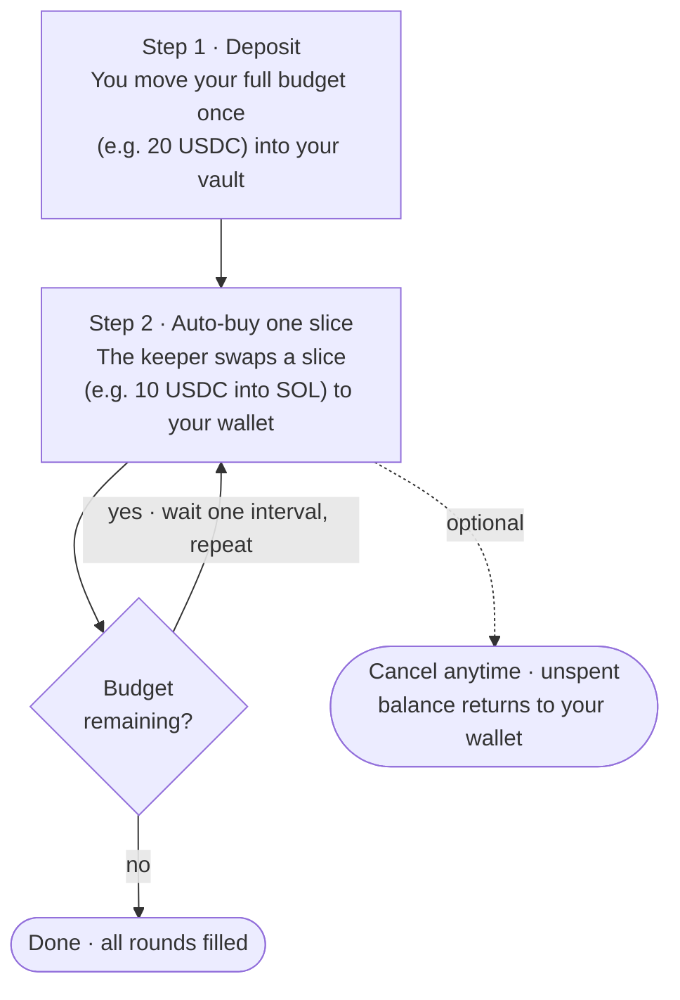

A DCA order splits one deposit into a series of swaps that run automatically on a fixed schedule, so you buy a little at a time instead of all at once. You deposit your full budget, choose how many rounds and how often, and Jupiter's keeper executes each round and sends the output to your wallet.

DCA is part of the Trigger API. It shares the same vault, [authentication](/trigger/authentication), and [deposit flow](/trigger/deposit) as [price orders](/trigger/create-order), so if you have already integrated those, the only new endpoint is `POST /trigger/v2/orders/dca`. This page covers creating an order; see [Track a DCA Order](/trigger/dca-history) to monitor it and [Cancel a DCA Order](/trigger/dca-cancel) to withdraw the unfilled remainder.

## How it works

Every wallet has one Privy-managed vault. You fund a DCA order by depositing into that vault, then the keeper draws from it each round:



You manage two moments: **creating** the order (deposit + schedule) and optionally [**cancelling**](/trigger/dca-cancel) it (withdraw the unfilled remainder). Everything in between, the per-round swaps, is handled by the keeper.

## Order types

Set `orderType` on create to choose how rounds execute.

| Type | Behaviour |
| :--- | :--- |
| `time_based` (default) | Executes every round on schedule. If a round cannot execute within its retry window, it is rescheduled to the next interval. The completion time is predictable. |
| `price_conditional` | Executes a round only while the trigger mint's USD price is inside `[minPriceUsd, maxPriceUsd]`. While the price is out of band, the round waits and is rescheduled to the next interval. |

Both types retry a stuck round within a window of `min(max(30, intervalSeconds / 2), 7200)` seconds before rescheduling it.

## Quick start

Creating a DCA order is four calls: authenticate, get your vault, craft and sign the deposit, then submit the order.

<Accordion title="Prerequisites">

Install the signing dependencies:

```bash
npm install @solana/web3.js bs58 tweetnacl
```

You also need a [Jupiter API key](https://developers.jup.ag/portal) and a funded wallet. The example below loads the wallet from `BS58_PRIVATE_KEY` and the key from `JUPITER_API_KEY` in your `.env`. For the browser-wallet (`signMessage`) version of authentication, see [Authentication](/trigger/authentication).

<Warning>
Never commit private keys. Use environment variables for testing and a proper key-management solution in production.
</Warning>
</Accordion>

```typescript expandable
import { Keypair, VersionedTransaction } from "@solana/web3.js";
import bs58 from "bs58";
import nacl from "tweetnacl";

const BASE = "https://api.jup.ag/trigger/v2";
const API_KEY = process.env.JUPITER_API_KEY!;
const USDC = "EPjFWdd5AufqSSqeM2qN1xzybapC8G4wEGGkZwyTDt1v";
const SOL = "So11111111111111111111111111111111111111112";

const wallet = Keypair.fromSecretKey(bs58.decode(process.env.BS58_PRIVATE_KEY!));
const owner = wallet.publicKey.toBase58();

// 1. Authenticate: sign the challenge to get a 24h JWT (see /trigger/authentication)
async function authenticate(): Promise<string> {
  const { challenge } = await fetch(`${BASE}/auth/challenge`, {
    method: "POST",
    headers: { "Content-Type": "application/json", "x-api-key": API_KEY },
    body: JSON.stringify({ walletPubkey: owner, type: "message" }),
  }).then((r) => r.json());

  const signature = nacl.sign.detached(new TextEncoder().encode(challenge), wallet.secretKey);
  const { token } = await fetch(`${BASE}/auth/verify`, {
    method: "POST",
    headers: { "Content-Type": "application/json", "x-api-key": API_KEY },
    body: JSON.stringify({ type: "message", walletPubkey: owner, signature: bs58.encode(signature) }),
  }).then((r) => r.json());
  return token;
}

async function createDca() {
  const token = await authenticate();
  const headers = { "Content-Type": "application/json", "x-api-key": API_KEY, Authorization: `Bearer ${token}` };

  // 2. Get your vault, registering one on first use
  let vault = await fetch(`${BASE}/vault`, { headers });
  if (!vault.ok) vault = await fetch(`${BASE}/vault/register`, { headers });
  if (!vault.ok) throw new Error(`vault failed: ${vault.status}`);

  // 3. Craft the deposit (orderType: "dca", no orderSubType)
  const deposit = await fetch(`${BASE}/deposit/craft`, {
    method: "POST",
    headers,
    body: JSON.stringify({ inputMint: USDC, outputMint: SOL, userAddress: owner, amount: "20000000", orderType: "dca" }),
  }).then((r) => r.json());
  if (!deposit.requestId) throw new Error(`craft failed: ${JSON.stringify(deposit)}`);

  // 4. Sign the deposit and submit the order (note: no trailing slash on /orders/dca)
  const tx = VersionedTransaction.deserialize(Buffer.from(deposit.transaction, "base64"));
  tx.sign([wallet]);

  const order = await fetch(`${BASE}/orders/dca`, {
    method: "POST",
    headers,
    body: JSON.stringify({
      depositRequestId: deposit.requestId,
      depositSignedTx: Buffer.from(tx.serialize()).toString("base64"),
      userPubkey: owner,
      inputMint: USDC,
      outputMint: SOL,
      inputAmount: "20000000", // 20 USDC total
      orderCount: 2,           // 2 rounds of 10 USDC
      intervalSeconds: 3600,   // one round per hour
      orderType: "time_based",
    }),
  }).then((r) => r.json());
  if (!order.id) throw new Error(`create failed: ${JSON.stringify(order)}`);

  console.log(`DCA order ${order.id}, deposit tx https://solscan.io/tx/${order.txSignature}`);
  return order.id as string;
}

createDca().catch(console.error);
```

The deposit lands on-chain during the create call, so a `200` means the order is live. The response is `{ id, txSignature }`, where `txSignature` is the on-chain deposit signature:

```json
{
  "id": "019f02b5-0400-72cc-8943-007c4310a3de",
  "txSignature": "4R18eTrkDvmZFPq87pznBPpVCpk1G2FQapWVks4ELLNYxAQZdwoDaxnnAHN2ZvBFrRvbnJSAPTnhutgj8ZzLFwgV"
}
```

<Note>
The vault address is resolved from your JWT, so you never pass it. The deposit `requestId` is single-use and is consumed by the create call as `depositRequestId`. Once the order is live, [track it](/trigger/dca-history).
</Note>

## Request parameters

The body of `POST /trigger/v2/orders/dca`:

| Parameter | Type | Required | Description |
| :--- | :--- | :--- | :--- |
| `depositRequestId` | `string` | Yes | The `requestId` returned by `/deposit/craft`. |
| `depositSignedTx` | `string` | Yes | Base64-encoded signed deposit transaction. |
| `userPubkey` | `string` | Yes | Your wallet public key. Must match the JWT. |
| `inputMint` | `string` | Yes | Mint of the token to sell. Native SOL is supported (wrapped automatically). Tokens with transfer-fee or transfer-hook extensions are rejected at the deposit step unless whitelisted. |
| `outputMint` | `string` | Yes | Mint of the token to buy. |
| `inputAmount` | `string` | Yes | Total amount to DCA, in the input token's smallest unit. Any remainder from uneven division is added to the last round. |
| `orderCount` | `number` | Yes | Number of rounds. Minimum 2, no fixed maximum (the current per-round \$10 minimum effectively caps it at your deposit in USD ÷ 10). |
| `intervalSeconds` | `number` | Yes | Seconds between rounds, from 60 (1 minute) to 31,536,000 (1 year). |
| `orderType` | `string` | No | `time_based` (default) or `price_conditional`. |
| `minPriceUsd` | `number` | No | Lower price bound. Price-conditional only. |
| `maxPriceUsd` | `number` | No | Upper price bound. Price-conditional only. |
| `triggerMint` | `string` | Cond. | Mint whose USD price is checked against the band. **Required** for `price_conditional`. Must be the input or output mint, and cannot be the stablecoin leg (use the volatile leg, usually `outputMint`). Ignored for `time_based`. |
| `beginFillAt` | `string` | No | ISO-8601 time to start the first round. Defaults to now, up to 30 days out. |

## Validation

The API validates the request before any funds move, so a rejected order costs nothing.

| Rule | Error on failure |
| :--- | :--- |
| Each round worth ≥ \$10, currently (the minimum is per-environment; `inputAmount ÷ orderCount`, \$0.20 tolerance) | `Each order must be at least 10 USD (current value: X USD)` |
| `orderCount` ≥ 2 | `Too small: expected number to be >=2` |
| `intervalSeconds` between 60 and 31,536,000 | `Too small/big: expected number to be >=60 / <=31536000` |
| `inputMint` ≠ `outputMint` | `Input mint and output mint cannot be the same` |
| `beginFillAt` is in the future | `Begin fill time must be in the future` |
| `beginFillAt` is ≤ 30 days out | `Begin fill time cannot be more than 30 days in the future` |
| At most 10 active orders per wallet | `Maximum of 10 active DCA orders allowed per user` |

Active orders are those in `depositing`, `active`, `executing`, or `withdrawing`. Cancel orders you no longer need to free up slots.

## Price-conditional orders

To accumulate only within a target price range, set `orderType: "price_conditional"`, at least one of `minPriceUsd` / `maxPriceUsd`, and a `triggerMint`:

```typescript
{
  // ...deposit and mints as above...
  inputAmount: "40000000",        // 40 USDC
  orderCount: 4,
  intervalSeconds: 86400,         // daily
  orderType: "price_conditional",
  triggerMint: SOL,               // check SOL's USD price
  minPriceUsd: 120,               // only buy while SOL is between
  maxPriceUsd: 180,               // $120 and $180
}
```

`triggerMint` must be the input or output mint, and cannot be the stablecoin side of the pair. In practice that is the volatile leg (here, SOL). A stablecoin trigger such as USDC is rejected with `400 "Trigger mint is not supported"`, and a pair where both legs are stable returns `400 "Mint pair is not supported"`. Omitting the bounds or the trigger returns a `400` identifying the missing field, and a `time_based` order that sets price bounds is rejected.

{/* UNRELEASED — Earn While You Wait (Jupiter Lend yield on idle DCA capital).
    Backend merged in trigger-order PR #516 (2026-06-24) and live on the API, but the feature
    is NOT publicly released: the LO/DCA Linear project LODCA-133 is still In Progress.
    Do NOT uncomment until the DCA team confirms public launch. When it ships, restore this
    section, the jlEnabled/jlMint create params, the jlEnabled response field, and the
    matching jl* fields commented out in openapi-spec/trigger/v2/trigger.yaml.

    Additional create parameters:
    - jlEnabled (boolean, default false): opt in to Earn While You Wait. time_based +
      stablecoin input only; requires the JL deposit craft.
    - jlMint (string): the Jupiter Lend earn token for your input stablecoin (from
      GET /lend/v1/earn/tokens). Required on the deposit craft and create when jlEnabled is true.

    ## Earn While You Wait

    Set jlEnabled: true to earn yield on the budget that has not been swapped yet. While the
    stablecoin sits in the vault between rounds it is supplied to Jupiter Lend (/lend) and earns
    yield until each round draws from it. Requirements:
    - The order must be time_based (price_conditional + jlEnabled returns 400).
    - The input mint must be a supported stablecoin (else 400 "jlEnabled is not supported for this input mint").

    Flow:
    1. Find the JL token: GET https://api.jup.ag/lend/v1/earn/tokens, match assetAddress to your
       inputMint, use its address as jlMint. USDC -> 9BEcn9aPEmhSPbPQeFGjidRiEKki46fVQDyPpSQXPA2D (jlUSDC).
    2. Craft the deposit with jlMint (POST /deposit/craft + orderType dca). The response returns
       jlTokenAccount instead of inputTokenAccount. Wrong jlMint -> 400 "jlMint does not match the JL token for this input mint".
    3. Create with jlEnabled: true (and jlMint) on POST /orders/dca.

    The order response carries jlEnabled: true. Cancelling unwinds the Lend position and returns
    the remaining stablecoin (with yield) to the wallet. Verified live e2e on 2026-06-27
    (order 019f0592-966e-736b-aedd-80fa56e2e399).
*/}

## Errors

Beyond the create-time [validation](#validation) above, these are the runtime errors you are most likely to hit across the DCA endpoints:

| When | Status | Error |
| :--- | :--- | :--- |
| Missing or expired JWT | `401` | `Unauthorized` |
| `userPubkey` does not match the authenticated wallet | `403` | `Forbidden: userPubkey must match authenticated user` |
| `depositRequestId` not found or already used | `400` | `Deposit transaction not found in cache. Please craft a new deposit first.` |
| `triggerMint` is the stablecoin leg of the pair | `400` | `Trigger mint is not supported` |
| Create called with a trailing slash | `404` | `Not Found` (use `POST /orders/dca`, no trailing slash) |
| Cancelling an order that is not `active` or `withdrawing` | `400` | `Cannot cancel DCA order in '<state>' state` |
| Confirm-cancel with a stale or wrong `cancelRequestId` | `400` | `Withdrawal transaction not found in cache. Please initiate cancel again.` |

## Related

<CardGroup cols={2}>
  <Card title="Track a DCA Order" href="/trigger/dca-history" icon="magnifying-glass">
    Monitor progress, fills, and state.
  </Card>
  <Card title="Cancel a DCA Order" href="/trigger/dca-cancel" icon="circle-xmark">
    Withdraw the unfilled remainder.
  </Card>
  <Card title="Create DCA Order (API)" href="/api-reference/trigger/create-dca" icon="code">
    Full request and response schema in the API reference.
  </Card>
  <Card title="Authentication" href="/trigger/authentication" icon="key">
    The challenge-response JWT flow every request needs.
  </Card>
</CardGroup>
