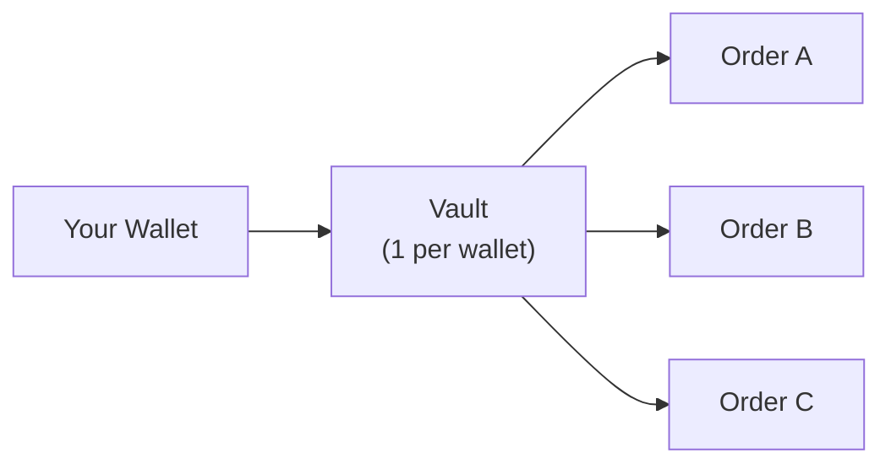

Every order, limit or DCA, is funded from a single per-wallet vault. Before creating any order you resolve your vault, then craft and sign a deposit transaction. This is the shared setup for both [price orders](/trigger/create-order) and [DCA](/trigger/dca): the only thing that differs is one field on the deposit. Every request needs the JWT from [authentication](/trigger/authentication) and the `x-api-key` header.

## The vault

Each wallet has one vault, a Privy-managed custodial account that holds deposits for all your orders. The vault address is resolved from your JWT, so you never pass it into later calls.



The examples below assume a `headers` object carrying your API key and the JWT from [authentication](/trigger/authentication):

```typescript
const BASE = "https://api.jup.ag/trigger/v2";
const headers = {
  "Content-Type": "application/json",
  "x-api-key": "your-api-key",
  Authorization: `Bearer ${token}`, // token from /trigger/authentication
};
```

## Get your vault

Retrieve your vault, or register one on first use:

```typescript
let vault = await fetch(`${BASE}/vault`, { headers });
if (!vault.ok) vault = await fetch(`${BASE}/vault/register`, { headers });
const { vaultPubkey } = await vault.json();
// { userPubkey, vaultPubkey, privyVaultId }
```

The code above calls `GET /vault` first and falls back to `GET /vault/register` on first use. `GET /vault/register` returns `409` if a vault already exists, so calling `GET /vault` first avoids that error.

## Craft a deposit

`POST /deposit/craft` builds an unsigned transaction that moves tokens from your wallet into your vault. Set `orderType` (and `orderSubType` for price orders) to match the order you are about to create.

```typescript
const deposit = await fetch(`${BASE}/deposit/craft`, {
  method: "POST",
  headers,
  body: JSON.stringify({
    inputMint: "So11111111111111111111111111111111111111112",   // SOL
    outputMint: "EPjFWdd5AufqSSqeM2qN1xzybapC8G4wEGGkZwyTDt1v",  // USDC
    userAddress: walletAddress,
    amount: "1000000000",   // 1 SOL, in the input token's smallest unit
    orderType: "price",     // "price" or "dca"
    orderSubType: "single", // price orders only
  }),
}).then((r) => r.json());
```

### Deposit parameters

| Parameter | Type | Required | Description |
| :--- | :--- | :--- | :--- |
| `inputMint` | `string` | Yes | Mint of the token to deposit and sell. Native SOL is wrapped automatically. Tokens with transfer-fee or transfer-hook extensions are rejected unless whitelisted. |
| `outputMint` | `string` | Yes | Mint of the token to buy. |
| `userAddress` | `string` | Yes | Your wallet public key. Must match the JWT. |
| `amount` | `string` | Yes | Total amount to deposit, in the input token's smallest unit (lamports for SOL). |
| `orderType` | `string` | Yes | `price` or `dca`. |
| `orderSubType` | `string` | Cond. | Price orders only: `single`, `oco`, or `otoco`. Omit for `dca`. |

Match the deposit to the order you will create:

| Deposit | Create it for |
| :--- | :--- |
| `orderType: "price"`, `orderSubType: "single"` | A standalone limit order |
| `orderType: "price"`, `orderSubType: "oco"` | A one-cancels-other (TP/SL) pair sharing one deposit |
| `orderType: "price"`, `orderSubType: "otoco"` | A parent trigger that activates an OCO pair. This also provisions an output token account |
| `orderType: "dca"` | A DCA order, time-based or price-conditional. No `orderSubType` |

For a price order, both `orderType: "price"` and `orderSubType` are required; omitting either returns a `4xx`.

The deposit `amount` must be worth at least 10 USD. A smaller amount is rejected at this step with `400 "Order must be at least 10 USD (current value: X USD)"`. For DCA, each round must also be worth at least 10 USD, checked when you [create the order](/trigger/dca).

### Response

```json
{
  "transaction": "Base64EncodedUnsignedTransaction...",
  "requestId": "01234567-89ab-cdef-0123-456789abcdef",
  "receiverAddress": "VaultPublicKey...",
  "mint": "So11111111111111111111111111111111111111112",
  "amount": "1000000000",
  "tokenDecimals": 9,
  "inputTokenAccount": "InputTokenAccountPubkey..."
}
```

For `orderSubType: "otoco"`, the response also includes `outputTokenAccount` for the account used by the conditional OCO pair.

<Note>
The vault address is resolved from your JWT, so you never pass it. You also do not pass `inputTokenAccount` or `outputTokenAccount` into the create call; the API stores them against the deposit `requestId`. The `requestId` is single-use and is consumed by the create call as `depositRequestId`.
</Note>

## Sign the deposit

Sign the returned transaction client-side. There is no separate submit step: you hand the signed transaction to the create call, which lands the deposit on-chain.

```typescript
import { VersionedTransaction } from "@solana/web3.js";

const tx = VersionedTransaction.deserialize(Buffer.from(deposit.transaction, "base64"));

// Browser wallet:
const signed = await wallet.signTransaction(tx);
const depositSignedTx = Buffer.from(signed.serialize()).toString("base64");

// Or a keypair:
// tx.sign([keypair]);
// const depositSignedTx = Buffer.from(tx.serialize()).toString("base64");
```

Carry two values into the create call:

- `deposit.requestId` → `depositRequestId`
- `depositSignedTx` → `depositSignedTx`

Then create the order for your family:

- Price orders: [Create Order](/trigger/create-order)
- DCA: [Create a DCA Order](/trigger/dca)

## Related

<CardGroup cols={2}>
  <Card title="Authentication" href="/trigger/authentication" icon="key">
    The challenge-response JWT flow every request needs.
  </Card>
  <Card title="Integration Flow" href="/trigger/lifecycle" icon="diagram-project">
    How the endpoints chain from auth to withdrawal.
  </Card>
  <Card title="Create Order (Limit)" href="/trigger/create-order" icon="circle-plus">
    Single, OCO, and OTOCO price orders.
  </Card>
  <Card title="Create a DCA Order" href="/trigger/dca" icon="circle-plus">
    Time-based and price-conditional schedules.
  </Card>
  <Card title="Craft Deposit (API)" href="/api-reference/trigger/deposit-craft" icon="code">
    Full deposit request and response schema.
  </Card>
</CardGroup>
