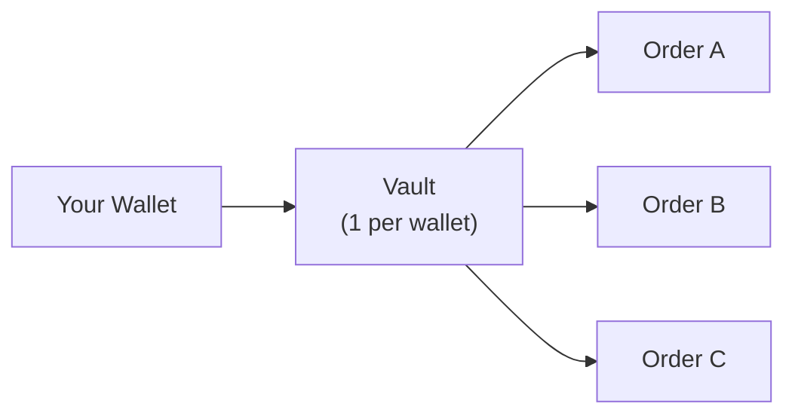

The Jupiter Trigger Order API enables automated order types on Solana. **Price orders** execute a swap when a USD price condition is met (limit orders, take-profit, stop-loss). **DCA orders** split a deposit into recurring swaps on a schedule. Both share one vault, authentication, and deposit flow.

Orders are stored off-chain and private by default, closing the most common MEV attack vector of visible pending orders. When an order triggers, Jupiter handles the swap: conversion, routing, and execution.

## What's New in V2

Trigger V2 unifies two products that previously had separate APIs: limit orders (Trigger V1) and DCA (the Recurring V1 API). Here is what changes if you are migrating from either.

### Limit orders: Trigger V1 vs V2

| Feature | Trigger V1 | Trigger V2 |
| :--- | :--- | :--- |
| **Trigger type** | Pool rate only (e.g. "1 Fartcoin = 0.00025 SOL") | USD price |
| **Order direction** | Buy below, sell above | Buy above, buy below, sell above, sell below |
| **TP/SL** | Not supported | Take-profit and stop-loss with OCO bundling |
| **Edit orders** | Must cancel and recreate | Edit trigger price and slippage in-place |
| **Partial fills** | Not supported | Orders fill partially for optimal execution prices |
| **Output amount** | Guaranteed (fixed pool rate) | Not guaranteed (prioritises trigger execution, pool price may vary) |
| **Authentication** | API key only | Challenge-response JWT + API key |
| **Order privacy** | Pending orders visible on-chain (PDA accounts) | Orders stored off-chain, private until execution |
| **Deposits** | Program-derived address (PDA) order accounts | Vault accounts (custodial) by Privy |
| **Route prefix** | `/trigger/v1` | `/trigger/v2` |

Trigger V1 is not scheduled for deprecation, but all development is focused on V2; V1 receives critical-only updates.

### DCA: Recurring V1 vs Trigger V2

DCA integrators are coming from the [Recurring API](/recurring), which is now unmaintained. What changes under Trigger V2:

| Feature | Recurring V1 | DCA (Trigger V2) |
| :--- | :--- | :--- |
| **Status** | Unmaintained | Actively maintained |
| **Schedule** | Time-based interval, optional min/max price (price-based strategy deprecated) | `time_based` or `price_conditional` (price band) |
| **Minimum size** | 100 USD total; time-based 50 USD per order, 2+ orders | 10 USD per round, 2+ rounds |
| **Authentication** | API key only | Challenge-response JWT + API key |
| **Deposits** | On-chain order accounts | Vault accounts (custodial) by Privy, shared across orders |
| **Token-2022** | Not supported | Supported, except transfer-fee or transfer-hook mints (unless whitelisted) |
| **Route prefix** | `/recurring/v1` | `/trigger/v2` |

## Order Families

The API has two order families that share the same vault, authentication, and deposit flow.

### Price Orders

Execute a swap when the USD price of a token crosses a threshold. See [Create Order](/trigger/create-order).

| Type | Description | Use case |
| :--- | :--- | :--- |
| **Single** | Triggers when USD price crosses above or below a threshold. Supports a trailing trigger that follows the market | Standard limit orders, stop-loss, trailing stop loss |
| **OCO** | Two orders sharing one deposit: one take-profit, one stop-loss. When one fills, the other cancels automatically | Risk management with TP/SL brackets (e.g. sell SOL at \$300 TP or \$200 SL while market is \$250) |
| **OTOCO** | A parent order triggers first, then activates a TP/SL pair (OCO) on the output | Conditional entry with automatic exit strategy |

### DCA (Dollar-Cost Averaging)

Split a single deposit into multiple swaps that execute on a fixed schedule. See [DCA](/trigger/dca).

| Type | Description | Use case |
| :--- | :--- | :--- |
| **Time-based** | Buys a fixed amount every interval until the deposit is spent | Recurring accumulation regardless of price |
| **Price-conditional** | Same schedule, but each round only fills while the price is within a `[min, max]` band | Recurring accumulation limited to a target price range |

## How It Works



Each wallet gets a single vault (a Privy-managed custodial account). When you create orders, tokens are deposited from your wallet into your vault. The vault holds funds for all your active orders.

1. [**Authenticate**](/trigger/authentication): Sign a challenge with your wallet to receive a JWT token
2. [**Set up your vault and deposit**](/trigger/deposit): Resolve your vault (or register one on first use), then craft and sign a deposit that funds the order
3. **Create an order**: Submit a [price order](/trigger/create-order) or a [DCA order](/trigger/dca) with the signed deposit
4. **Monitor**: Track order state, fills, and events for [price orders](/trigger/order-history) or [DCA orders](/trigger/dca-history)
5. **Manage**: Update or cancel [price orders](/trigger/manage-orders), or cancel [DCA orders](/trigger/dca-cancel)

See [Integration Flow](/trigger/lifecycle) for the full call sequence and how each call's output feeds the next.

## Base URL

```
https://api.jup.ag/trigger/v2
```

All endpoints require an API key via the `x-api-key` header. Authenticated endpoints additionally require a JWT token via the `Authorization: Bearer <token>` header.

<Card title="Get an API key" href="https://developers.jup.ag/portal" icon="key" iconType="solid" horizontal/>

## FAQ

<AccordionGroup>

<Accordion title="How do I get my funds back from an order?">
For a price order that expired or that you no longer want, funds stay in the vault; retrieve them with the two-step cancel flow (initiate, sign the withdrawal, confirm). See [Expired Order Withdrawal](/trigger/manage-orders#expired-order-withdrawal). For a DCA order, cancelling returns the unfilled remainder to your wallet; rounds already filled are not reversed. See [Cancel a DCA Order](/trigger/dca-cancel).
</Accordion>

<Accordion title="Can I edit an order after creating it?">
Price orders can be updated in-place (trigger price and slippage) without cancelling and recreating. See [Update an Order](/trigger/manage-orders#update-an-order). DCA orders cannot be edited: to change a DCA, cancel it and create a new one.
</Accordion>

<Accordion title="Why is the output amount not guaranteed?">
V2 uses USD price triggers rather than pool rate triggers. When the price condition is met, the order executes a swap at the current market rate via Jupiter routing. The actual output depends on liquidity and slippage at execution time.
</Accordion>

<Accordion title="What is the minimum order size?">
Price orders: 10 USD equivalent. DCA: at least 10 USD per round, so the total minimum is 10 USD × the number of rounds (a 2-round DCA needs at least 20 USD).
</Accordion>

<Accordion title="What happens if my JWT expires while I have open orders?">
Open orders continue to be monitored and will execute normally. The JWT is only required for API calls (creating, editing, cancelling orders). When your token expires, re-authenticate to manage your orders.
</Accordion>

<Accordion title="What is an OCO order?">
A One-Cancels-Other order creates a take-profit and stop-loss pair that share one deposit. When one side fills, the other cancels automatically, returning unused funds to the vault.
</Accordion>

<Accordion title="What is an OTOCO order?">
A One-Triggers-One-Cancels-Other order has a parent trigger that executes first. Once the parent fills, it automatically activates a TP/SL pair (OCO) on the output tokens. If the parent expires or fails, the child orders are never created.
</Accordion>

<Accordion title="What is a DCA order?">
A DCA (dollar-cost averaging) order splits one deposit into multiple swaps that run on a schedule. You set the total amount, the number of rounds (2 or more), and the interval (1 minute to 1 year). Rounds can run unconditionally (`time_based`) or only within a price band (`price_conditional`). Each round must currently be worth at least 10 USD. See [DCA](/trigger/dca).
</Accordion>

<Accordion title="How do I stop a DCA order and get unspent funds back?">
Cancel it. Cancelling withdraws the unfilled remainder to your wallet; rounds already filled are not reversed. See [Cancel a DCA Order](/trigger/dca-cancel).
</Accordion>

<Accordion title="What is a price-conditional DCA?">
A DCA order type that fills a round only while the trigger mint's USD price is inside `[minPriceUsd, maxPriceUsd]`. While the price is out of band, the round waits and reschedules to the next interval. See [Price-conditional orders](/trigger/dca#price-conditional-orders).
</Accordion>

<Accordion title="What is the default slippage?">
For price orders: take-profit and buy-below orders use auto slippage via RTSE (Real-Time Slippage Estimator), and stop-loss and buy-above orders default to 20% (2000 bps) because execution certainty matters more when cutting losses. You can set a custom slippage. DCA orders have no slippage parameter: the keeper sets slippage per round from live market conditions at fill time.
</Accordion>

<Accordion title="Can I set a trigger based on market cap?">
The API accepts USD price triggers only (`triggerPriceUsd`). Market cap targeting is a convenience feature on the jup.ag frontend — it converts the market cap to a USD price before submitting to the API. To replicate this, divide the target market cap by the token's total supply to get the per-token USD price.
</Accordion>

<Accordion title="Are my pending orders visible to MEV bots?">
No. V2 orders are stored off-chain and private by default. Order details (price, size, direction) are not revealed until the trigger condition is met and execution begins. In V1, pending orders were stored in on-chain PDA accounts, giving bots a roadmap to front-run profitable trades.
</Accordion>

<Accordion title="Does Trigger V2 support integrator fees?">
Not currently, and there is no timeline for adding them. There is no atomic workaround because the keeper executes the transaction and the order is opaque to integrators. The only option is to run a separate transfer transaction outside the order flow.
</Accordion>

</AccordionGroup>
